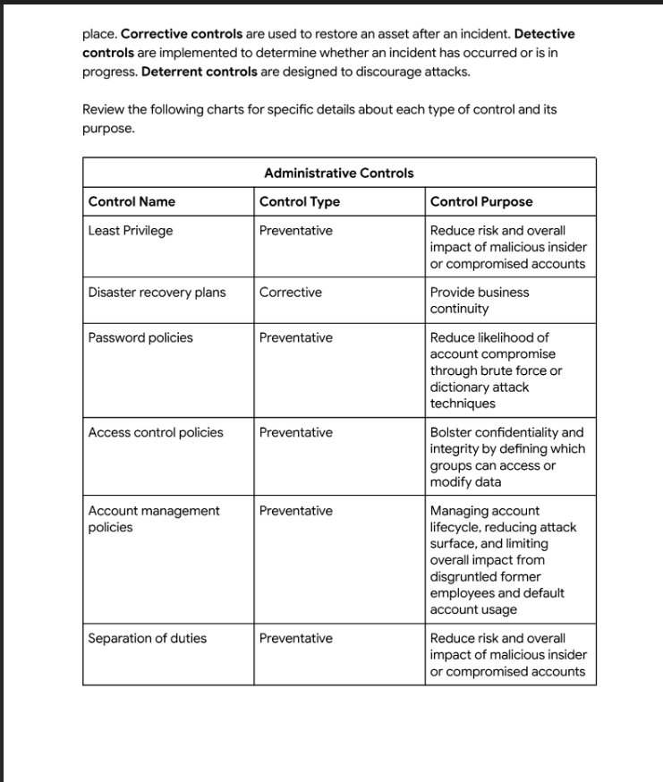
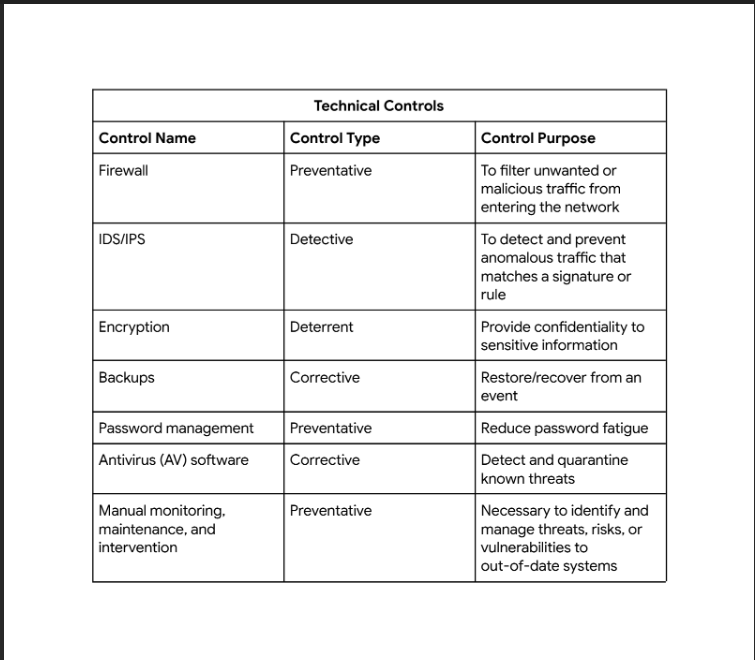
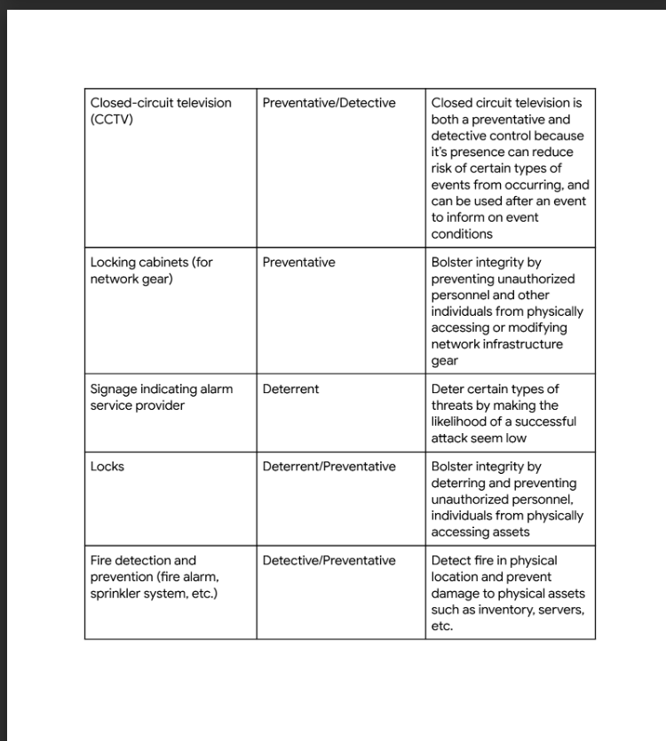
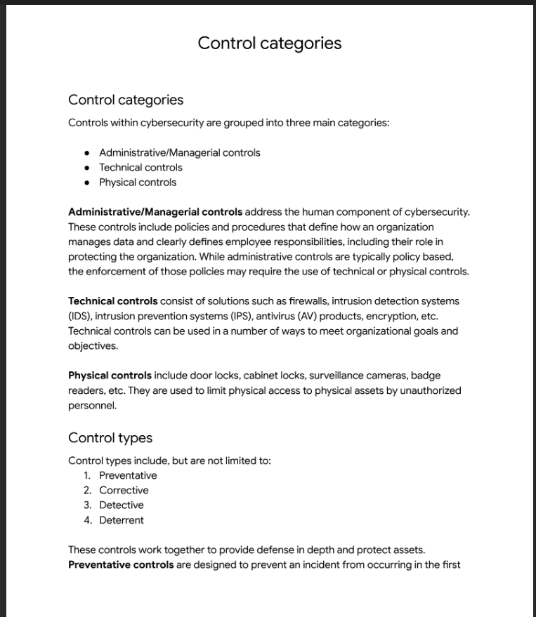

# Google Cybersecurity Professional Certificate — Project Portfolio
**Olayinka Abimbowo | Aspiring Cybersecurity Analyst | Canada**

---

## 🎯 Objective

This portfolio documents my hands-on learning journey through the
Google Cybersecurity Professional Certificate. Each module includes
real projects, security audits, and labs designed to build practical
analyst skills. My focus is on developing the technical and analytical
abilities required to work as a Security Operations Center (SOC)
Analyst or Junior Cybersecurity Analyst in both private sector and
government environments.

---

## 🛡️ Projects Completed

### Project 1 — Botium Toys Internal Security Audit

📁 [View Full Project](https://github.com/Halo-hub501/Cybersecurity-Portfolio/tree/main/Security-Audit-Botium-Toys)

**Objective:** Conduct a full internal security audit for a fictional
toy company to assess existing controls and compliance gaps.

**Skills Demonstrated:**
- Completed a full Controls Assessment Checklist across 14 controls
- Assessed compliance against PCI DSS, GDPR, and SOC frameworks
- Identified critical gaps including missing encryption, no IDS,
  no disaster recovery plan, and no least privilege controls
- Wrote formal recommendations to the IT Manager
- Applied NIST Cybersecurity Framework principles throughout

**Tools and Frameworks Used:**
- NIST Cybersecurity Framework
- CIA Triad
- PCI DSS, GDPR, SOC compliance frameworks
- Security audit methodology

**Outcome:** Identified 8 missing critical controls and 3 compliance
gaps. Provided prioritized remediation recommendations.

### Project 2 — Networks and Network Security (Module 3)

📁 [View Full Project](https://github.com/Halo-hub501/Cybersecurity-Portfolio/tree/main/Networks-and-Network-Security)

**Objective:** Apply network security concepts through four hands-on projects covering attack analysis, hardening, and incident response.

**Projects Completed:**

| # | Project | Report Type | Description |
|---|---------|-------------|-------------|
| 1 | [DNS and ICMP Traffic Analysis](Networks-and-Network-Security/01-dns-icmp-traffic-analysis/dns-icmp-traffic-analysis-report.md) | tcpdump Incident Report | Analyzed a tcpdump log to identify why a website was unreachable — DNS server port 53 returning ICMP "unreachable" errors |
| 2 | [SYN Flood Attack Analysis](Networks-and-Network-Security/02-syn-flood-attack-analysis/attack-analysis-report.md) | Wireshark Incident Report | Analyzed Wireshark TCP log to identify a SYN flood DoS attack against a travel agency's web server |
| 3 | [Brute Force and Malware Injection](Networks-and-Network-Security/03-brute-force-malware-injection/brute-force-malware-injection-report.md) | Security Incident Report | Investigated a two-stage attack: brute-force admin login followed by malware injection into a bakery website |
| 4 | [Security Risk Assessment](Networks-and-Network-Security/04-security-risk-assessment/network-hardening-report.md) | Network Hardening Report | Post-breach assessment for a social media org; identified 4 vulnerabilities and recommended hardening controls |
| 5 | [NIST CSF Incident Report — DDoS ICMP Flood](Networks-and-Network-Security/05-nist-csf-ddos-icmp-analysis/incident-response-report.md) | NIST CSF Analysis | Applied all 5 NIST CSF functions to a DDoS/ICMP flood attack on a multimedia company |

**Tools and Frameworks Used:**
- NIST Cybersecurity Framework (all 5 functions)
- TCP/IP and OSI model analysis
- Network protocol analysis (DNS, HTTP, TCP, ICMP)
- Wireshark log interpretation
- OS and network hardening checklists

**Outcome:** Four professional analyst reports demonstrating practical skills in network attack identification, hardening, and structured incident response.

---

## 📚 Skills Learned

### Module 1 — Foundations of Cybersecurity ✅
- Understanding of the CIA Triad — Confidentiality, Integrity, Availability
- History and evolution of cyber attacks
- Core responsibilities of a security analyst
- Threat actors, vulnerabilities, and risk concepts
- Introduction to SIEM tools

### Module 2 — Play It Safe: Manage Security Risks ✅
- Security frameworks and controls
- NIST Cybersecurity Framework (CSF)
- OWASP security principles
- Security audits and compliance assessments
- PCI DSS, GDPR, SOC frameworks
- Control categories — Administrative, Technical, Physical

### Module 3 — Connect and Protect: Networks and Network Security ✅
- Network architecture: TCP/IP model, OSI model, common protocols
- Network attack types: DoS, DDoS, SYN flood, ICMP flood, DNS poisoning, packet sniffing
- Network hardening: firewall rules, port filtering, network segmentation, MFA
- OS hardening: patch management, account lockout policies, principle of least privilege
- Incident response using NIST CSF across all 5 functions
- Wireshark TCP log analysis for attack identification

---

## 🔧 Tools Used

### Network Analysis

### SIEM

### Languages (In Development)

---

## 📜 Certifications

- ✅ Module 1: Foundations of Cybersecurity — Complete
- ✅ Module 2: Play It Safe: Manage Security Risks — Complete (Mar 10, 2026) | [Verify](https://coursera.org/verify/7HQ8W6WYSQC9)
- 🔄 Google Cybersecurity Professional Certificate — Full Certificate In Progress
- ⏳ CompTIA Security+ — Upcoming

---

## 📸 Project Screenshots

### Botium Toys Security Audit

*Ref 1: Administrative Controls*

*Ref 2: Technical Controls*

*Ref 3: Physical Controls*

*Ref 4: Control Categories*

---

## 📈 Portfolio Progress

| Module | Topic | Status |
|--------|-------|--------|
| 1 | Foundations of Cybersecurity | ✅ Complete |
| 2 | Play It Safe: Manage Security Risks | ✅ Complete — Mar 10, 2026 |
| 3 | Networks and Network Security | ✅ Complete — Mar 18, 2026 |
| 4 | Linux and SQL | ⏳ Upcoming |
| 5 | Assets, Threats and Vulnerabilities | ⏳ Upcoming |
| 6 | Detection and Response | ⏳ Upcoming |
| 7 | Python Automation | ⏳ Upcoming |
| 8 | Job Preparation | ⏳ Upcoming |

---

## 📫 Connect With Me
- 🔗 LinkedIn: https://www.linkedin.com/in/olayinka-abimbowo-b3369b2b0
- 📁 GitHub: https://github.com/Halo-hub501
