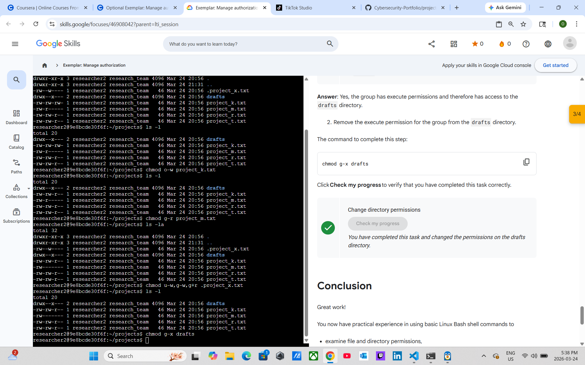

# Lab 6: Manage Authorization

**Course:** Tools of the Trade: Linux and SQL (Course 4)
**Module:** Linux commands in the Bash shell
**Status:** ✅ Completed

---

## Lab Completion



---

## Objective

Use Linux commands to examine and manage file and directory permissions in the `/home/researcher2/projects` directory — a core authorization skill for security analysts responsible for ensuring that the correct users have the correct access to files.

---

## Starting File Structure & Permissions

```
~/projects
├── .project_x.txt   (hidden)  -rw--w----   researcher2  research_team
├── drafts/                    drwx--x---   researcher2  research_team
├── project_k.txt              -rw-rw-rw-   researcher2  research_team
├── project_m.txt              -rw-r-----   researcher2  research_team
├── project_r.txt              -rw-rw-r--   researcher2  research_team
└── project_t.txt              -rw-rw-r--   researcher2  research_team
```

---

## Tasks & Commands

### Task 1 — Check file and directory details

```bash
ls -l
ls -la
```

`ls -l` lists visible files with permission strings, owner, group, size, and timestamp.
`ls -la` adds hidden files (prefixed with `.`) to the output.

**Key observation:** `.project_x.txt` is a hidden file not shown by a standard `ls -l`.

---

### Task 2 — Describe the permissions string

Permission strings are 10 characters. Example: `-rw-rw-rw-`

| Position | Meaning |
|----------|---------|
| 1 | Type: `-` = file, `d` = directory |
| 2–4 | Owner (user) permissions: `r` read, `w` write, `x` execute |
| 5–7 | Group permissions |
| 8–10 | Other (world) permissions |

For `project_k.txt` (`-rw-rw-rw-`): owner, group, and others all have read and write access — **others should not have write access** per company policy.

---

### Task 3 — Change file permissions

**Remove write permission from `others` on `project_k.txt`:**

```bash
chmod o-w project_k.txt
ls -l
```

**Before:** `-rw-rw-rw-`
**After:** `-rw-rw-r--` ✅

---

**Remove read permission from `group` on `project_m.txt`:**

```bash
chmod g-r project_m.txt
ls -l
```

**Before:** `-rw-r-----`
**After:** `-rw-------` ✅

---

### Task 4 — Change permissions on a hidden file

`.project_x.txt` is archived and no one should have write access. The user and group both need read access only.

```bash
chmod u-w,g-w,g+r .project_x.txt
ls -la
```

**Before:** `-rw--w----`
**After:** `-r--r-----` ✅

Single `chmod` command with comma-separated clauses to apply multiple changes at once.

---

### Task 5 — Change directory permissions

The `drafts` directory should only be accessible by the owner (`researcher2`). The group currently has execute (`x`) permission, which grants directory access.

```bash
chmod g-x drafts
ls -l
```

**Before:** `drwx--x---`
**After:** `drwx------` ✅

> **Confirmed by lab:** "Yes, the group has execute permissions and therefore has access to the drafts directory." — removing `x` closes that access.

---

## Key Skills Demonstrated

| Skill | Command |
|-------|---------|
| List file permissions | `ls -l` |
| List including hidden files | `ls -la` |
| Remove write from others | `chmod o-w <file>` |
| Remove read from group | `chmod g-r <file>` |
| Multiple permission changes at once | `chmod u-w,g-w,g+r <file>` |
| Restrict directory access | `chmod g-x <directory>` |

---

## Key Takeaways

- The 10-character permission string breaks into type + owner + group + other
- `chmod` uses symbolic notation: `u` (user/owner), `g` (group), `o` (others), `a` (all); `+` adds, `-` removes
- Execute (`x`) on a **directory** controls whether users can enter it — not just run files inside it
- Hidden files (`.filename`) are not shown by `ls -l`; use `ls -la` to reveal them
- Multiple permission changes can be chained in one `chmod` call with commas: `chmod u-w,g-w,g+r`
- Authorization management is foundational for least-privilege security: users should only have the access they need
