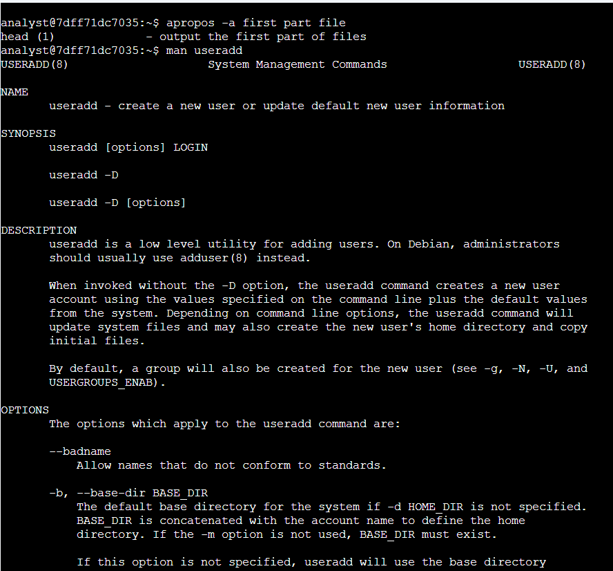

# Get Help in the Command Line

**Course:** Tools of the Trade: Linux and SQL (Course 4)
**Certificate:** Google Cybersecurity Professional Certificate
**Status:** Completed

---

## Project Description

As a security analyst working in Linux, you will frequently encounter commands and options you are not immediately familiar with. In this lab, I practiced using three built-in Linux help tools — `man`, `whatis`, and `apropos` — to explore unfamiliar commands directly from the terminal without relying on external resources.

---

## Task 1: Use `man` to Explore the `useradd` Command

I needed to find which option sets an expiration date for a temporary user account. I used the `man` command to open the full manual page for `useradd`.

```bash
analyst@b86260066a15:~$ man useradd
```



The `man` command opens the full manual (man page) for a command. Inside the `useradd` man page, I found the following entry:

```
-e, --expiredate EXPIRE_DATE
    The date on which the user account will be disabled.
    The date is specified in the format YYYY-MM-DD.
```

This confirmed that the `-e` option is used to set an expiration date for a temporary user account. I pressed `Q` to exit the man page.

**Answer:** `-e`

---

## Task 2: Use `whatis` to Compare `rm` and `rmdir`

I used the `whatis` command to get a quick one-line description of both commands to understand the difference between them.

```bash
analyst@b86260066a15:~$ whatis rm
rm (1)      - remove files or directories

analyst@b86260066a15:~$ whatis rmdir
rmdir (1)   - remove empty directories
rmdir (2)   - delete a directory
```


The `whatis` command returns a short one-line description of a command pulled from its man page. The output shows that `rm` removes files or directories (including non-empty ones), while `rmdir` only removes **empty** directories. This is an important distinction — using the wrong command could either fail or unintentionally delete files.

---

## Task 3: Use `apropos` to Find a Command by Keyword

I needed to identify the correct command for creating a new group, but could not remember the exact name. I used `apropos` to search by keywords.

```bash
analyst@b86260066a15:~$ apropos -a create new group
groupadd (8)    - create a new group
```


The `apropos` command searches man page descriptions for matching keywords. The `-a` flag requires **all** keywords to match (AND logic), which narrows the results. The output identified `groupadd` as the command for creating a new group.

**Answer:** `groupadd`

---

## Summary

In this lab, I used three built-in Linux help tools to explore commands and locate the information I needed without leaving the terminal. These tools are essential for any security analyst who works regularly in Linux environments.

| Command | Purpose | Example |
|---------|---------|---------|
| `man <command>` | Full manual page with all options and details | `man useradd` |
| `whatis <command>` | One-line description of a command | `whatis rm` |
| `apropos -a <keywords>` | Find a command by what it does | `apropos -a create new group` |

**Key findings:**
- `useradd -e` sets an account expiration date in `YYYY-MM-DD` format
- `rm` removes files or directories; `rmdir` only removes **empty** directories
- `groupadd` is the command used to create a new group (found via `apropos`)
