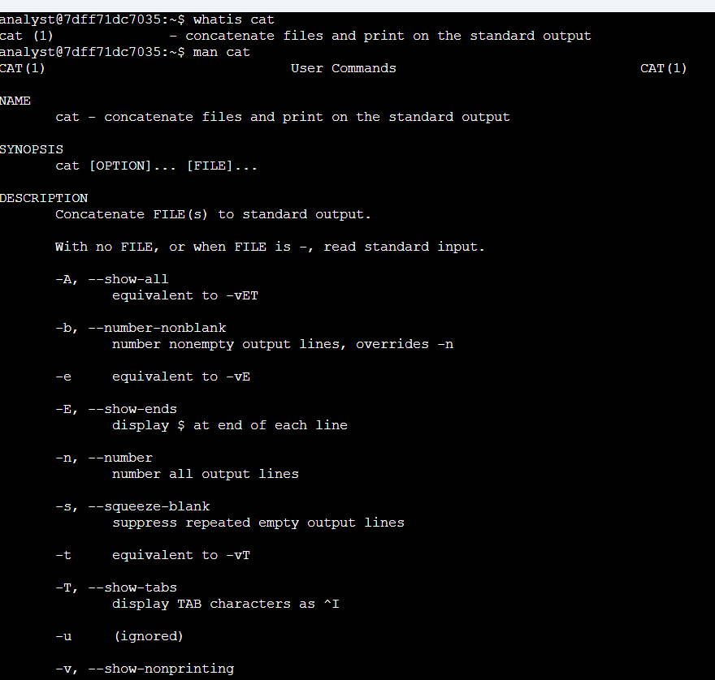
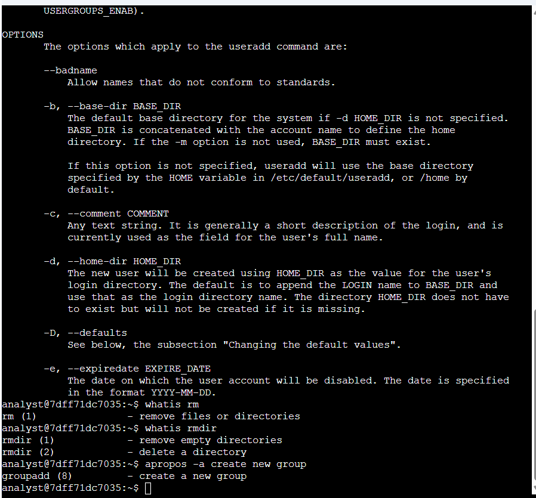

# Get Help in the Command Line

**Course:** Tools of the Trade: Linux and SQL (Course 4)
**Certificate:** Google Cybersecurity Professional Certificate
**Status:** Completed

---

## Project Description

As a security analyst working in Linux, you will frequently encounter commands and options you are not immediately familiar with. In this lab, I practiced using three built-in Linux help tools — `man`, `whatis`, and `apropos` — to explore unfamiliar commands directly from the terminal without relying on external resources.

---

## Task 1: Use `man` to Explore the `useradd` Command

I needed to find which option sets an expiration date for a temporary user account. I first used `whatis` to get a quick description of `cat`, then opened its full man page to understand the format before moving on to `useradd`.

```bash
analyst@7dff71dc7035:~$ whatis cat
cat (1)        - concatenate files and print on the standard output
analyst@7dff71dc7035:~$ man cat
```



I then used `apropos` to search for commands related to files, and opened the `useradd` man page to find the expiration date option.

```bash
analyst@7dff71dc7035:~$ apropos -a first part file
head (1)        - output the first part of files
analyst@7dff71dc7035:~$ man useradd
```


Inside the `useradd` man page, I found:

```
-e, --expiredate EXPIRE_DATE
    The date on which the user account will be disabled.
    The date is specified in the format YYYY-MM-DD.
```

This confirmed that `-e` is the option used to set an expiration date. I pressed `Q` to exit the man page.

**Answer:** `-e`

---

## Task 2: Use `whatis` and `apropos` to Find Commands

I used `whatis` to compare `rm` and `rmdir`, then `apropos` to search for the command to create a new group.

```bash
analyst@7dff71dc7035:~$ whatis rm
rm (1)          - remove files or directories
analyst@7dff71dc7035:~$ whatis rmdir
rmdir (1)       - remove empty directories
rmdir (2)       - delete a directory
analyst@7dff71dc7035:~$ apropos -a create new group
groupadd (8)    - create a new group
```



**What I learned:**
- `whatis` gives a quick one-line description pulled from the man page
- `rm` removes files or directories; `rmdir` only removes **empty** directories
- `apropos -a` searches man page descriptions — the `-a` flag requires all keywords to match
- `groupadd` is the command used to create a new group

**Answer:** `groupadd`

---

## Summary

In this lab, I used three built-in Linux help tools to explore commands and find information without leaving the terminal.

| Command | Purpose | Example |
|---------|---------|---------|
| `man <command>` | Full manual page with all options | `man useradd` |
| `whatis <command>` | One-line description | `whatis rm` |
| `apropos -a <keywords>` | Find a command by what it does | `apropos -a create new group` |

**Key findings:**
- `useradd -e` sets an account expiration date in `YYYY-MM-DD` format
- `rm` removes files or directories; `rmdir` only removes **empty** directories
- `groupadd` is the command to create a new group
