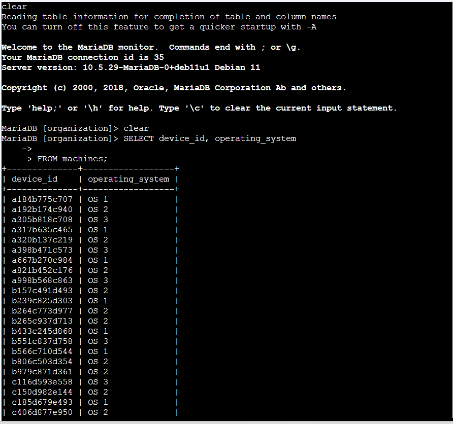
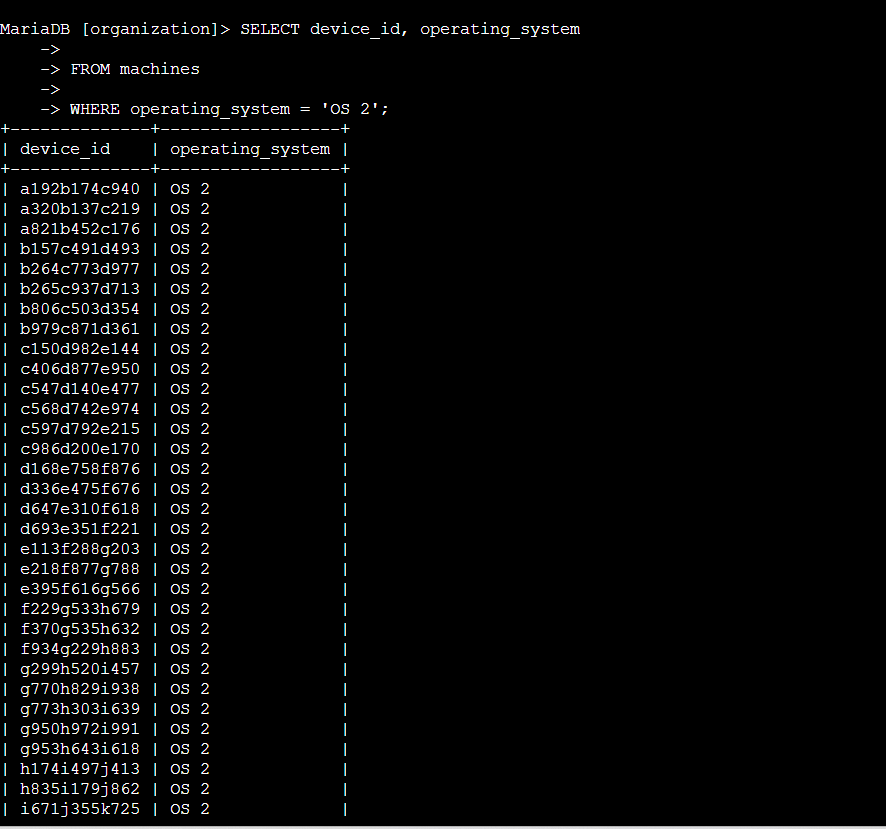
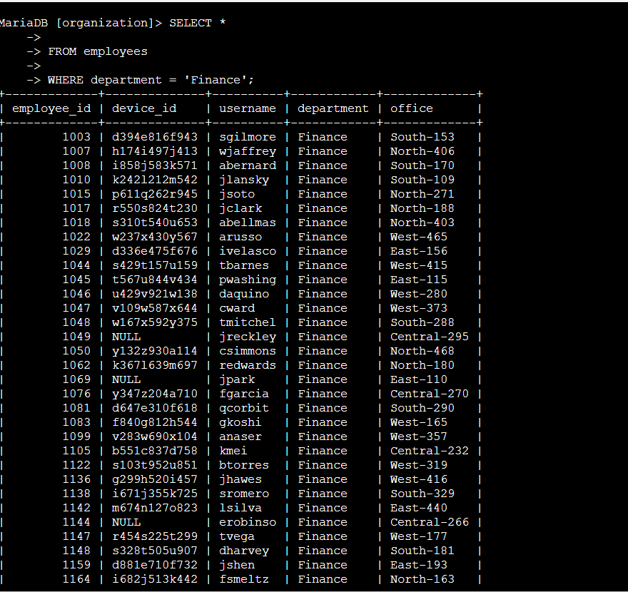
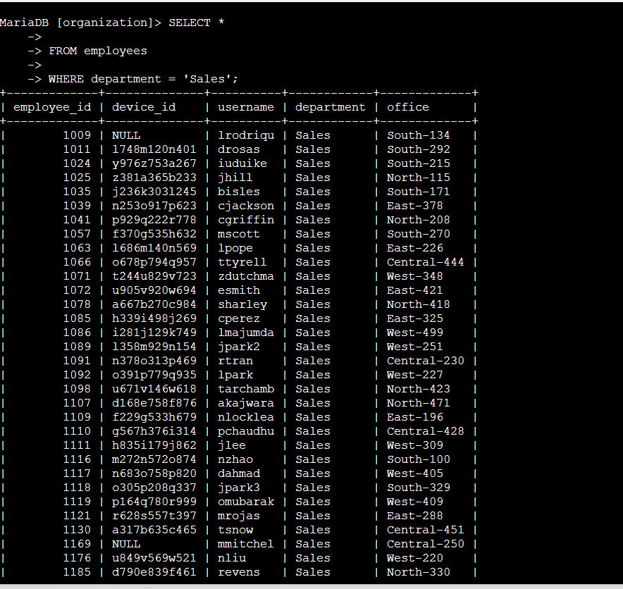
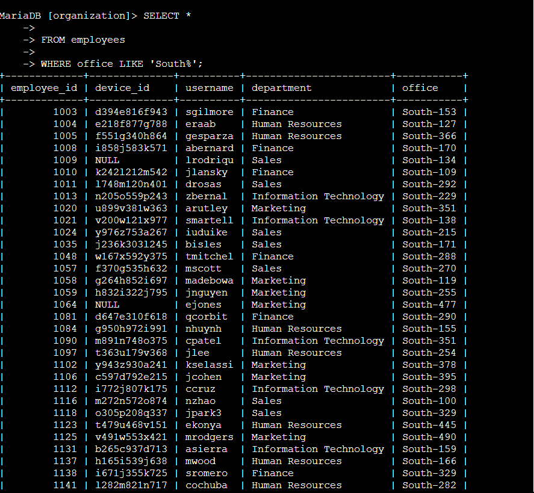

# SQL Filters with WHERE and LIKE

**Course:** Tools of the Trade: Linux and SQL (Course 4)
**Certificate:** Google Cybersecurity Professional Certificate
**Status:** Completed

---

## Project Description

As a security analyst, I was tasked with identifying which machines needed operating system updates and locating employees in specific departments and buildings. To do this, I applied the `WHERE` clause to filter SQL query results and used the `LIKE` operator with the `%` wildcard to match patterns in data. All queries were run against the `organization` database in the MariaDB shell.

---

## Task 1: List All Organization Machines

I retrieved the `device_id` and `operating_system` columns from the `machines` table to get a full inventory of all employee devices.

```sql
SELECT device_id, operating_system
FROM machines;
```



```
+--------------+------------------+
| device_id    | operating_system |
+--------------+------------------+
| a184b775c707 | OS 1             |
| a192b174c940 | OS 2             |
| a305b818c708 | OS 3             |
| a317b635c465 | OS 1             |
| a320b137c219 | OS 2             |
| a398b471c573 | OS 3             |
| ...                              |
+--------------+------------------+
200 rows in set (0.028 sec)
```

The query returned **200 rows**, confirming the total number of devices in the organization. Using `SELECT` with specific column names rather than `*` focuses the output on only the relevant fields.

---

## Task 2: Retrieve Machines with OS 2

I filtered the `machines` table to return only devices running `OS 2`, as these machines required an update.

```sql
SELECT device_id, operating_system
FROM machines
WHERE operating_system = 'OS 2';
```



```
+--------------+------------------+
| device_id    | operating_system |
+--------------+------------------+
| a192b174c940 | OS 2             |
| a320b137c219 | OS 2             |
| a821b452c176 | OS 2             |
| b157c491d493 | OS 2             |
| b264c773d977 | OS 2             |
| ...                              |
+--------------+------------------+
80 rows in set (0.264 sec)
```

The `WHERE` clause filters results to only return records that match the specified condition. Out of 200 total machines, **80 machines** run `OS 2` and need to be updated. The value `'OS 2'` is wrapped in single quotes because it is a string.

---

## Task 3: List Employees in Specific Departments

I queried the `employees` table to retrieve employees from the Finance and Sales departments so that notices about handling confidential information could be sent to their offices.

### Finance Department

```sql
SELECT *
FROM employees
WHERE department = 'Finance';
```



The first employee returned had an `employee_id` of **1003**. The Finance department list included employees across various office locations (South, North, West, East, and Central buildings).

### Sales Department

```sql
SELECT *
FROM employees
WHERE department = 'Sales';
```



The query returned **33 employees** in the Sales department. By simply changing the value in the `WHERE` clause from `'Finance'` to `'Sales'`, the same query structure was reused to target a different department — demonstrating how flexible SQL filtering is.

---

## Task 4: Identify Employee Machines in the South Building

My team discovered issues with machines in the South building. I first identified the specific employee using the affected machine in `South-109`, then retrieved all employees in the South building.

### Find the employee using South-109

```sql
SELECT *
FROM employees
WHERE office = 'South-109';
```

The query returned **jlansky** as the employee using the machine in `South-109`. This allowed the team to send a targeted alert to that specific employee.

### All employees in the South building

```sql
SELECT *
FROM employees
WHERE office LIKE 'South%';
```



The `LIKE` operator with the `%` wildcard matches any string that starts with `'South'`, regardless of what follows the hyphen. This returned all employees across every South building office (South-109, South-127, South-134, etc.). The first employee listed belonged to the **Finance** department.

The `%` wildcard is powerful because it removes the need to know the exact office number — it matches any South building office in a single query.

---

## Summary

In this lab, I applied SQL filtering techniques to retrieve targeted security-relevant data from the `organization` database. The `WHERE` clause enabled exact matches on specific values, while the `LIKE` operator with `%` enabled pattern-based filtering across multiple records.

| Query | Purpose | Result |
|-------|---------|--------|
| `SELECT device_id, operating_system FROM machines` | Full device inventory | 200 machines |
| `WHERE operating_system = 'OS 2'` | Filter devices needing update | 80 machines |
| `WHERE department = 'Finance'` | Finance employees for notice | First ID: 1003 |
| `WHERE department = 'Sales'` | Sales employees for notice | 33 employees |
| `WHERE office = 'South-109'` | Identify affected employee | jlansky |
| `WHERE office LIKE 'South%'` | All South building employees | First: Finance dept |
