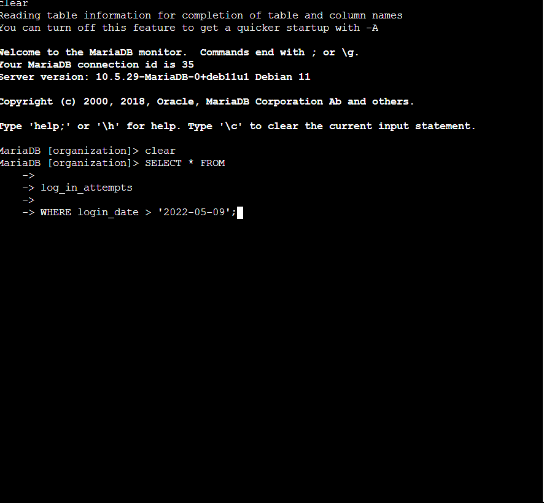
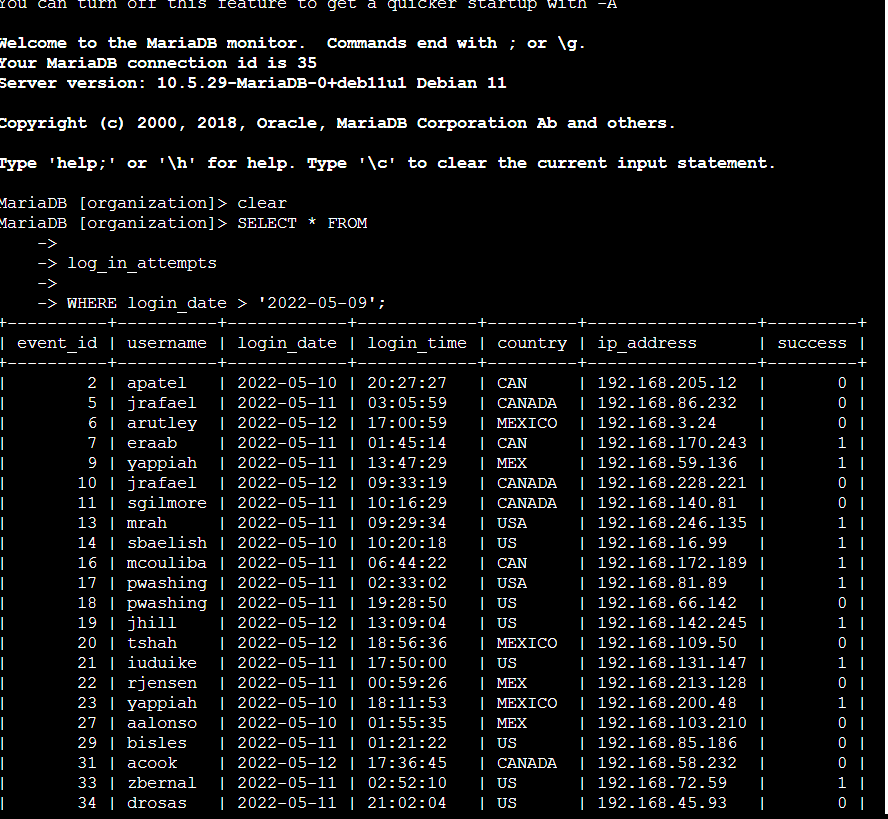
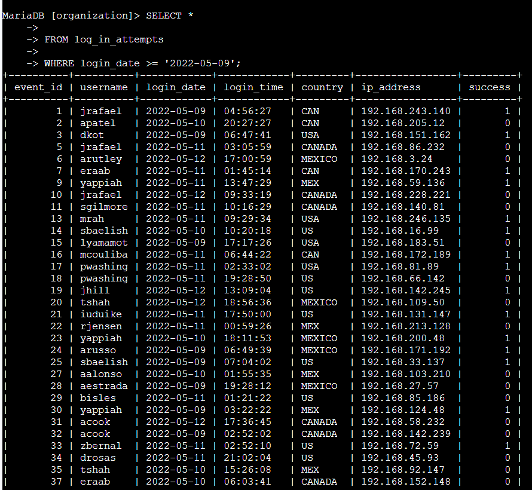
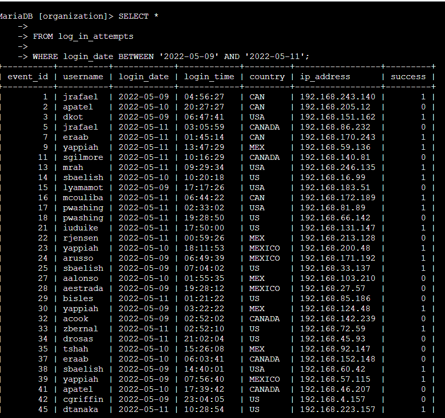

# SQL Filters for Numbers and Dates

**Course:** Tools of the Trade: Linux and SQL (Course 4)
**Certificate:** Google Cybersecurity Professional Certificate
**Status:** Completed

---

## Project Description

As a security analyst investigating a recent security incident, I needed to gather information about login attempts for certain dates and times. I applied comparison operators (`>`, `>=`, `<`, `<=`, `<>`, `=`) and the `BETWEEN` and `AND` operators to filter numeric and date/time data from the `log_in_attempts` table in the `organization` database.

---

## Task 1: Retrieve Login Attempts After a Certain Date

### Step 1 — Login attempts strictly after 2022-05-09

```sql
SELECT *
FROM log_in_attempts
WHERE login_date > '2022-05-09';
```



The `>` operator returns only records where the login date is strictly after the specified date, excluding 2022-05-09 itself. This returned **125 login attempts**.

---

### Step 2 — Login attempts on or after 2022-05-09

```sql
SELECT *
FROM log_in_attempts
WHERE login_date >= '2022-05-09';
```



The `>=` operator includes the specified date in the results. Adding 2022-05-09 to the range increased the results to **165 login attempts** — the difference of 40 records represents logins that occurred on 2022-05-09 itself.

---

## Task 2: Retrieve Logins in a Date Range

```sql
SELECT *
FROM log_in_attempts
WHERE login_date BETWEEN '2022-05-09' AND '2022-05-11';
```



The `BETWEEN` operator filters results to include both the start and end dates. This narrowed the focus to **123 login attempts** made between 2022-05-09 and 2022-05-11, excluding anything before or after that window.

---

## Task 3: Investigate Logins at Certain Times

### Step 1 — All logins before 07:00:00

```sql
SELECT *
FROM log_in_attempts
WHERE login_time < '07:00:00';
```



I filtered for logins made before the organization's typical start time of 07:00:00 to identify users logging in outside of normal hours. The fifth record returned had the username **eraab**.

---

### Step 2 — Logins between 06:00:00 and 07:00:00

```sql
SELECT *
FROM log_in_attempts
WHERE login_time BETWEEN '06:00:00' AND '07:00:00';
```

Narrowing the time window to the hour before work begins returned a more focused set of results. The earliest login attempt in this range was at **06:01:31**, indicating someone logged in very early and potentially outside expected behavior.

---

## Task 4: Investigate Logins by Event ID

### Step 1 — Event IDs greater than or equal to 100

```sql
SELECT event_id, username, login_date
FROM log_in_attempts
WHERE event_id >= 100;
```

I selected only the `event_id`, `username`, and `login_date` columns to keep the output focused. Note that numeric values like event IDs do not use single quotation marks. The third result returned had a login date of **2022-05-09**.

---

### Step 2 — Event IDs between 100 and 150

```sql
SELECT event_id, username, login_date
FROM log_in_attempts
WHERE event_id BETWEEN 100 AND 150;
```

Further narrowing the event ID range to between 100 and 150 filtered out higher-numbered events. The seventh result returned had the username **tmitchel**.

---

## Summary

In this lab, I used SQL comparison operators and the `BETWEEN` keyword to filter date, time, and numeric data from the `log_in_attempts` table during a security incident investigation.

| Query | Operator Used | Result |
|-------|--------------|--------|
| `WHERE login_date > '2022-05-09'` | `>` | 125 attempts |
| `WHERE login_date >= '2022-05-09'` | `>=` | 165 attempts |
| `WHERE login_date BETWEEN '2022-05-09' AND '2022-05-11'` | `BETWEEN` | 123 attempts |
| `WHERE login_time < '07:00:00'` | `<` | 5th record: eraab |
| `WHERE login_time BETWEEN '06:00:00' AND '07:00:00'` | `BETWEEN` | Earliest: 06:01:31 |
| `WHERE event_id >= 100` | `>=` | 3rd record: 2022-05-09 |
| `WHERE event_id BETWEEN 100 AND 150` | `BETWEEN` | 7th record: tmitchel |
