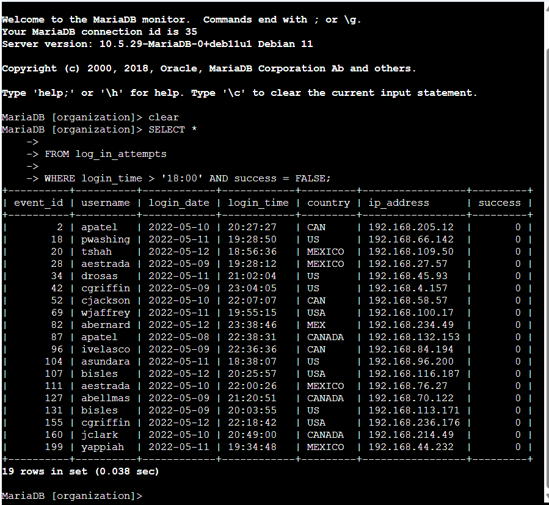
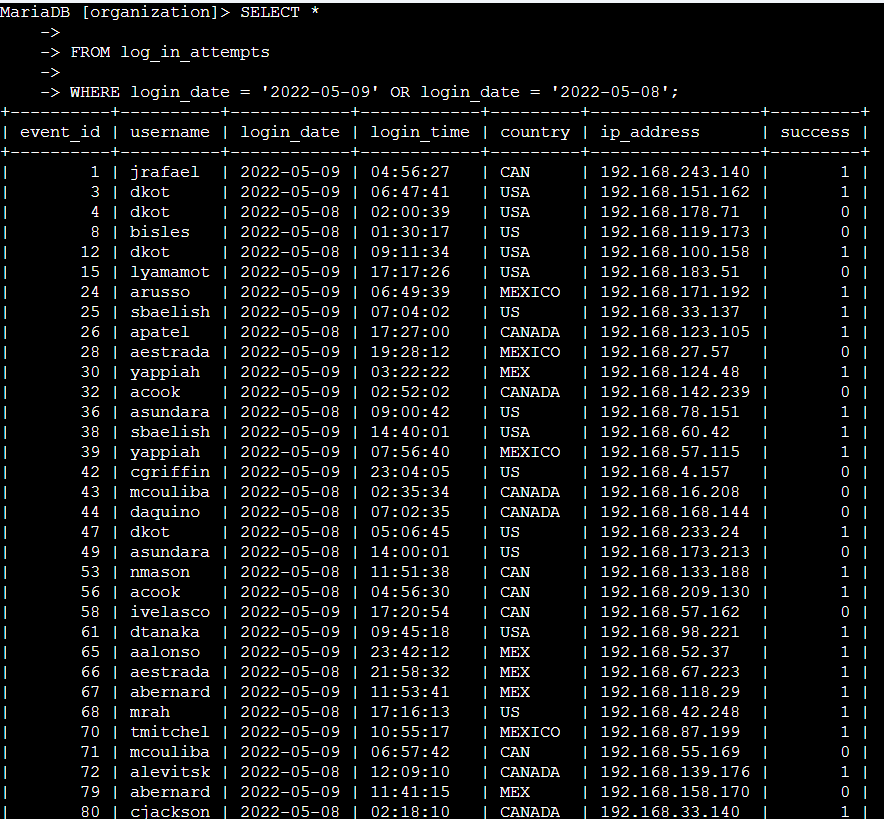
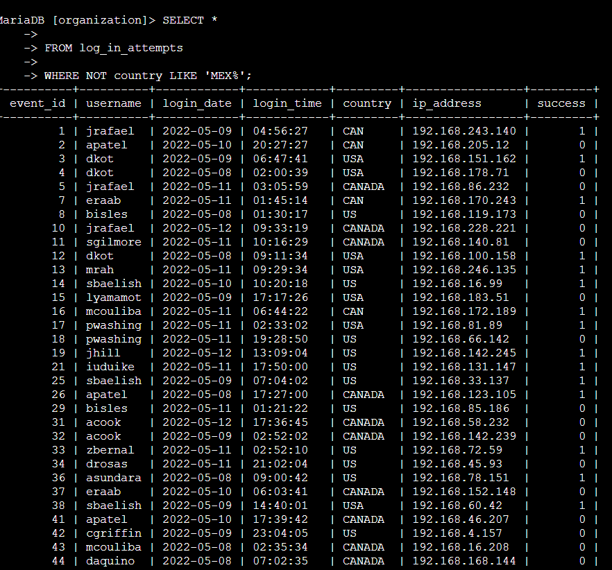
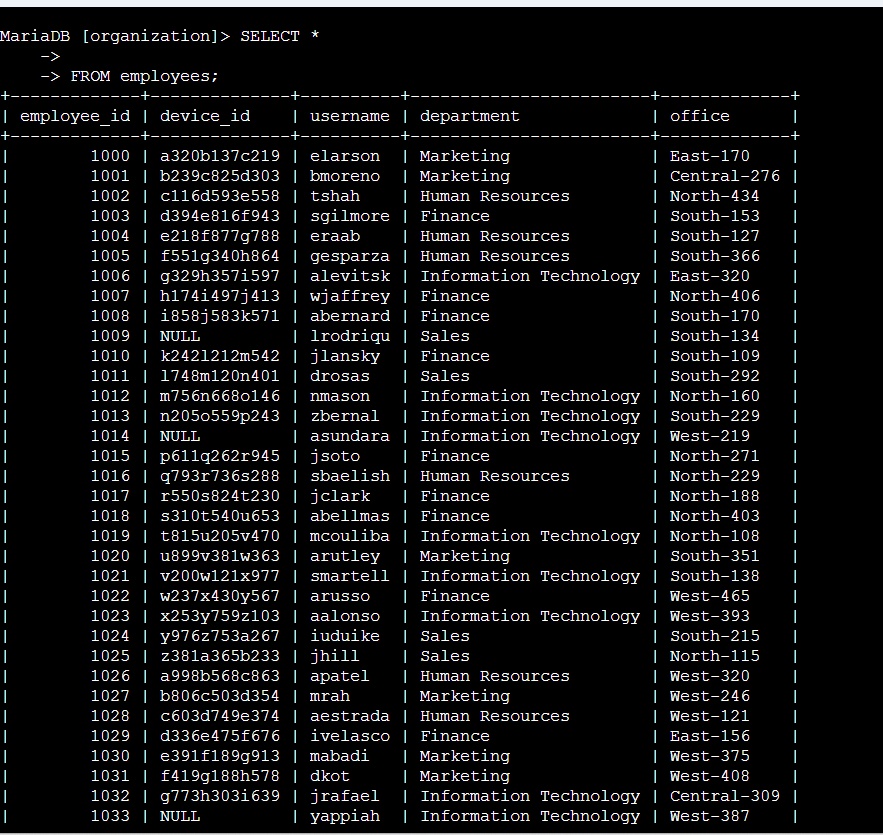
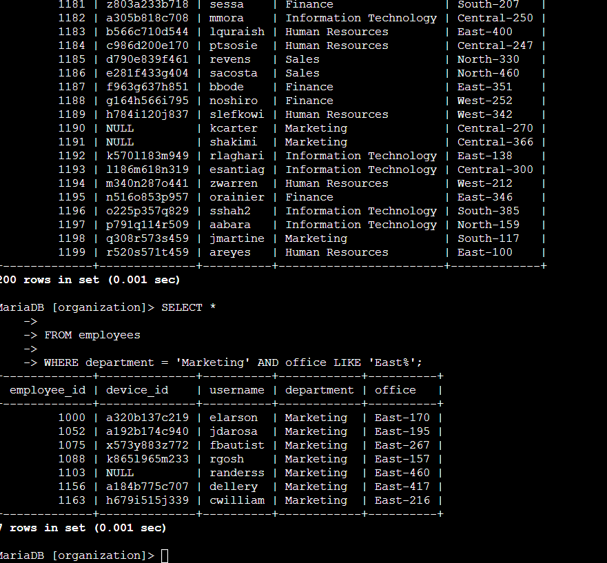
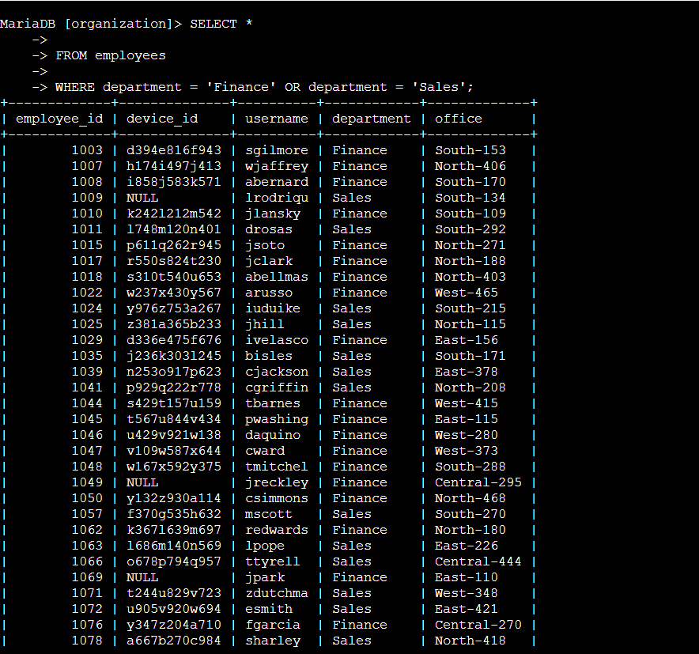
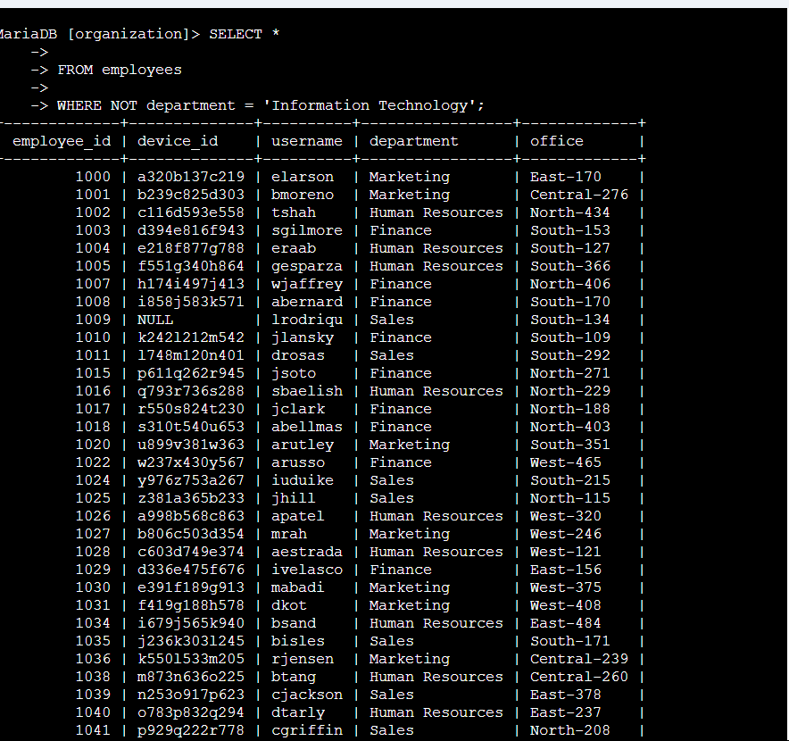

# SQL Filters with AND, OR, and NOT

**Course:** Tools of the Trade: Linux and SQL (Course 4)
**Certificate:** Google Cybersecurity Professional Certificate
**Status:** Completed

---

## Project Description

As a security analyst investigating suspicious login activity and preparing for a system update, I needed to retrieve specific records from both the `log_in_attempts` and `employees` tables. I applied the `AND`, `OR`, and `NOT` logical operators to combine multiple filter conditions in SQL queries, alongside the `LIKE` operator for pattern matching.

---

## Task 1: Retrieve After-Hours Failed Login Attempts

```sql
SELECT *
FROM log_in_attempts
WHERE login_time > '18:00' AND success = FALSE;
```



I used the `AND` operator to require both conditions to be true at the same time — the login must have occurred after 18:00 and must have failed. `FALSE` is not placed in single quotes because it is Boolean data, not a string. This query returned **19 failed login attempts** after business hours.

---

## Task 2: Retrieve Login Attempts on Specific Dates

```sql
SELECT *
FROM log_in_attempts
WHERE login_date = '2022-05-09' OR login_date = '2022-05-08';
```



The `OR` operator returns records where at least one condition is true, so this query captures login attempts from either date. A suspicious event occurred on 2022-05-09, so I also included the day before to capture any related activity. This returned **75 login attempts** across the two days.

---

## Task 3: Retrieve Login Attempts Outside of Mexico

```sql
SELECT *
FROM log_in_attempts
WHERE NOT country LIKE 'MEX%';
```



The `NOT` operator excludes records that match the condition. Since the country field stores values as both `MEX` and `MEXICO`, I used `LIKE 'MEX%'` with the `%` wildcard to match both formats, then applied `NOT` to exclude them all. This returned **144 login attempts** that did not originate in Mexico.

---

## Task 4: Retrieve Employees in Marketing (East Building)

I first ran a general query to view the structure and values in the `employees` table before writing the filtered query.

```sql
SELECT *
FROM employees;
```



Then I applied filters for department and office location:

```sql
SELECT *
FROM employees
WHERE department = 'Marketing' AND office LIKE 'East%';
```



I used `AND` to require both conditions: the employee must be in the `Marketing` department and their office must start with `East` (matching offices like East-170, East-320, etc.). The first employee returned was **elarson**.

---

## Task 5: Retrieve Employees in Finance or Sales

```sql
SELECT *
FROM employees
WHERE department = 'Finance' OR department = 'Sales';
```



The `OR` operator retrieves employees from either department. Both conditions reference the same `department` column, but each full condition must still be written out separately — `WHERE department = 'Finance' OR department = 'Sales'` is correct, while `WHERE department = 'Finance' OR 'Sales'` would not work. The first employee in the Sales department was **lrodriqu**.

---

## Task 6: Retrieve All Employees Not in IT

```sql
SELECT *
FROM employees
WHERE NOT department = 'Information Technology';
```



The `NOT` operator excludes all employees in the Information Technology department. This was useful because the IT update had already been applied — I only needed the remaining employees. This returned **161 employees** not in IT.

---

## Summary

In this lab, I used the `AND`, `OR`, and `NOT` logical operators to filter data across two tables during a security investigation and system update.

| Query | Operator(s) Used | Result |
|-------|-----------------|--------|
| `WHERE login_time > '18:00' AND success = FALSE` | `AND` | 19 failed attempts |
| `WHERE login_date = '2022-05-09' OR login_date = '2022-05-08'` | `OR` | 75 attempts |
| `WHERE NOT country LIKE 'MEX%'` | `NOT`, `LIKE` | 144 attempts |
| `WHERE department = 'Marketing' AND office LIKE 'East%'` | `AND`, `LIKE` | First: elarson |
| `WHERE department = 'Finance' OR department = 'Sales'` | `OR` | First in Sales: lrodriqu |
| `WHERE NOT department = 'Information Technology'` | `NOT` | 161 employees |
