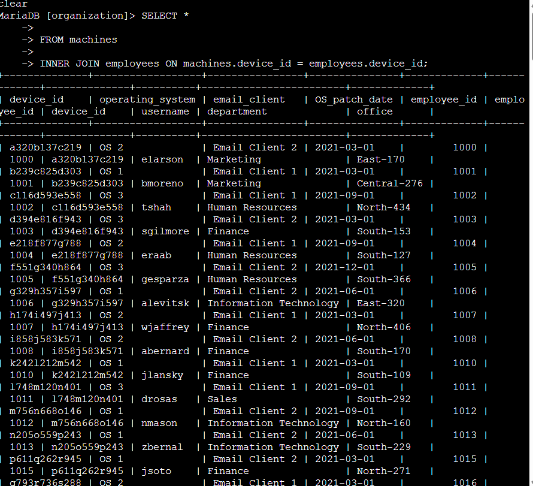
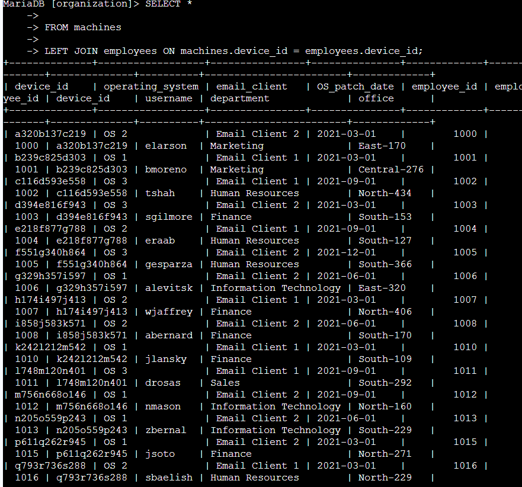
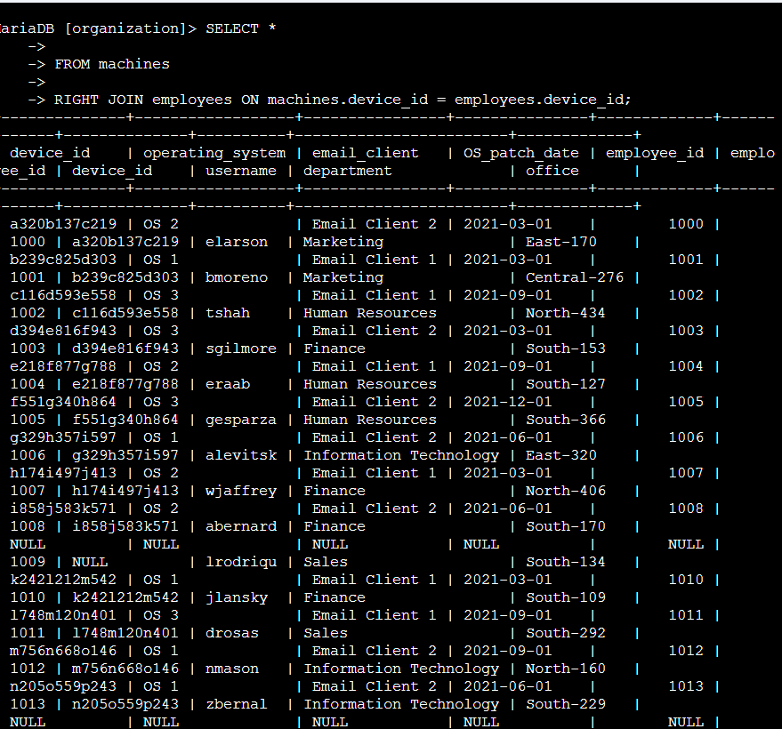
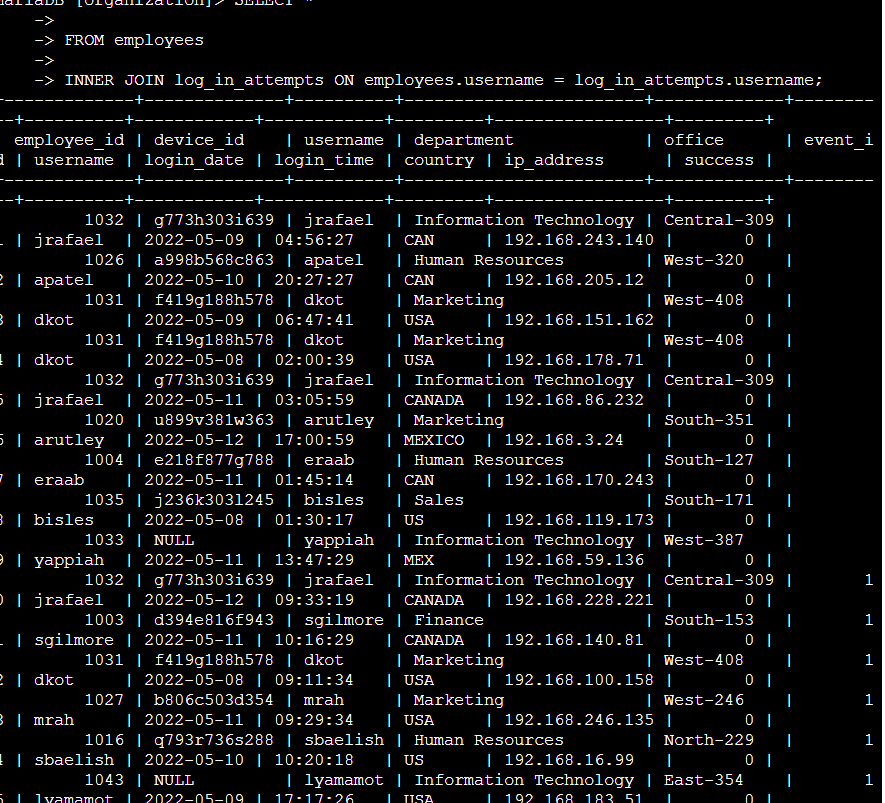

# SQL Joins

**Course:** Tools of the Trade: Linux and SQL (Course 4)
**Certificate:** Google Cybersecurity Professional Certificate
**Status:** Completed

---

## Project Description

As a security analyst investigating a security incident, I needed to combine data from multiple tables in the organization's database. I used SQL joins — INNER JOIN, LEFT JOIN, and RIGHT JOIN — to connect the `machines`, `employees`, and `log_in_attempts` tables and retrieve the specific records needed for the investigation.

---

## Task 1: Match Employees to Their Machines

I needed to identify which employees are using which machines. Both the `machines` and `employees` tables share the `device_id` column, which I used as the connecting column for the join.

```sql
SELECT *
FROM machines
INNER JOIN employees ON machines.device_id = employees.device_id;
```



An INNER JOIN returns only the records where there is a match in both tables. Any machine without an assigned employee or any employee without a machine would be excluded. This query returned **185 rows**.

---

## Task 2: Return More Data

### Left Join — All Machines

I used a LEFT JOIN to return all machines, including those not assigned to any employee.

```sql
SELECT *
FROM machines
LEFT JOIN employees ON machines.device_id = employees.device_id;
```



A LEFT JOIN returns all records from the left table (`machines`) regardless of whether there is a match in the right table (`employees`). Machines with no assigned employee show `NULL` in the username column. The last record returned had a username of **NULL**.

---

### Right Join — All Employees

I used a RIGHT JOIN to return all employees, including those without an assigned machine.

```sql
SELECT *
FROM machines
RIGHT JOIN employees ON machines.device_id = employees.device_id;
```



A RIGHT JOIN returns all records from the right table (`employees`) regardless of whether there is a match in the left table (`machines`). The last record returned had a username of **areyes**.

---

## Task 3: Retrieve Login Attempt Data

To investigate which employees made login attempts, I performed an INNER JOIN between the `employees` and `log_in_attempts` tables using the common `username` column.

```sql
SELECT *
FROM employees
INNER JOIN log_in_attempts ON employees.username = log_in_attempts.username;
```



This returned only records where the username appeared in both tables — meaning employees who had at least one login attempt on record. The query returned **200 records**.

---

## Summary

In this lab, I used SQL joins to combine data from multiple tables during a security investigation.

| Query | Join Type | Result |
|-------|----------|--------|
| `machines INNER JOIN employees ON device_id` | INNER JOIN | 185 rows |
| `machines LEFT JOIN employees ON device_id` | LEFT JOIN | Last record: NULL |
| `machines RIGHT JOIN employees ON device_id` | RIGHT JOIN | Last record: areyes |
| `employees INNER JOIN log_in_attempts ON username` | INNER JOIN | 200 records |
