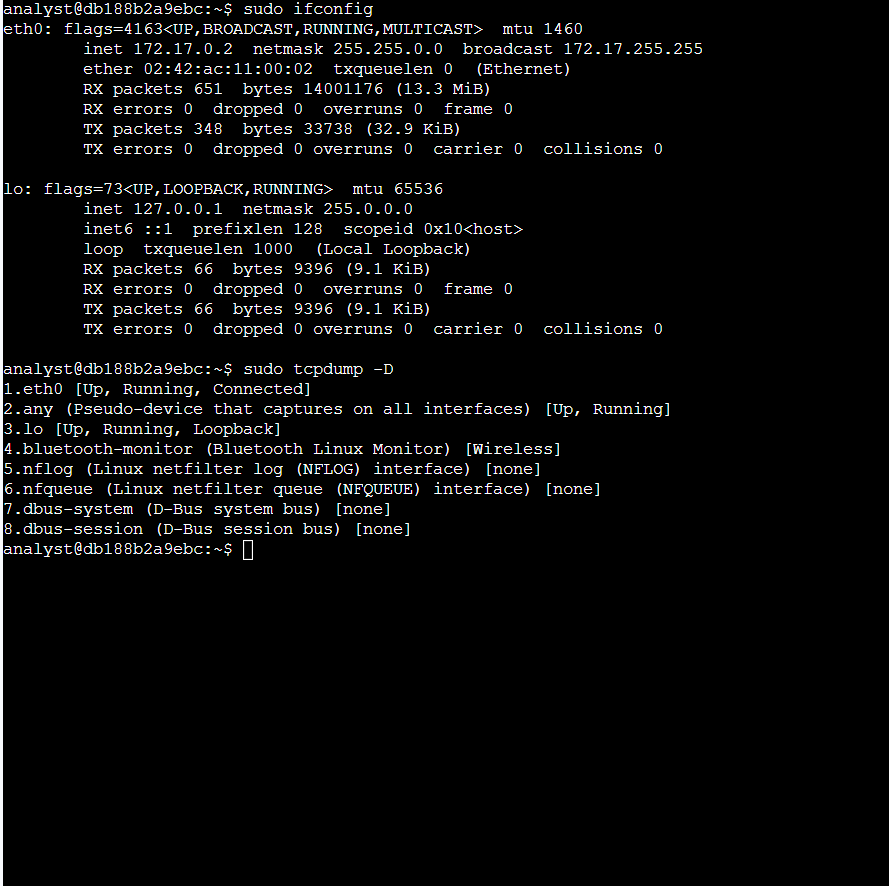
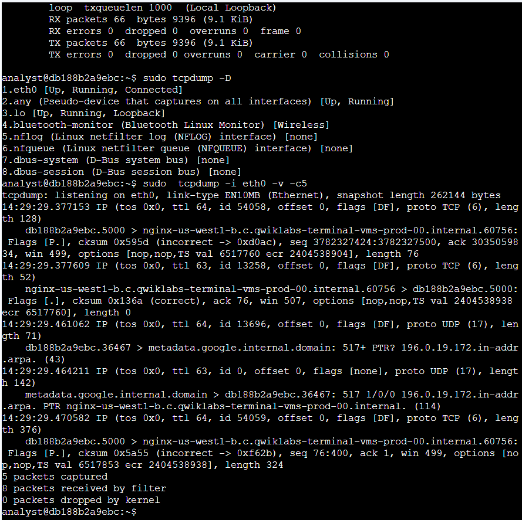
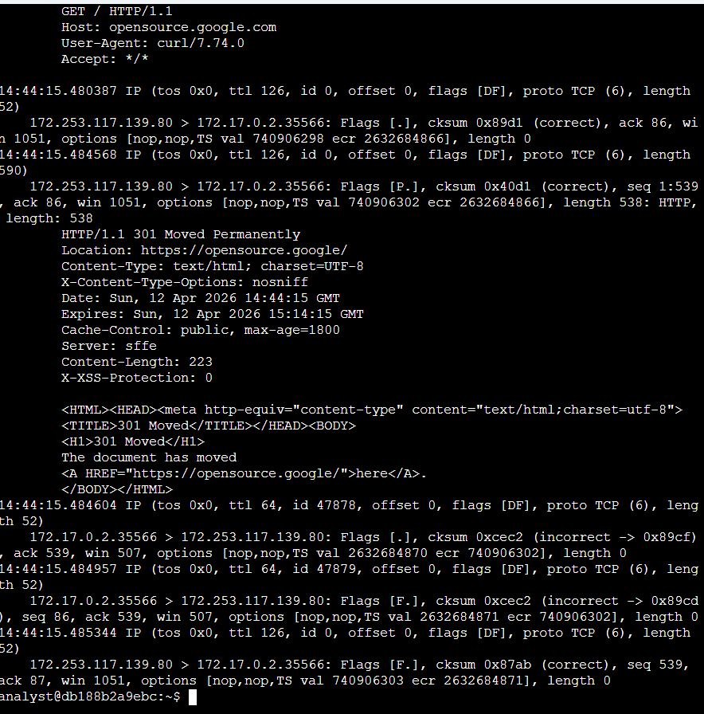
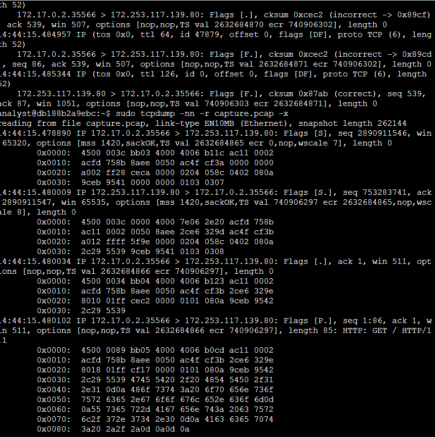
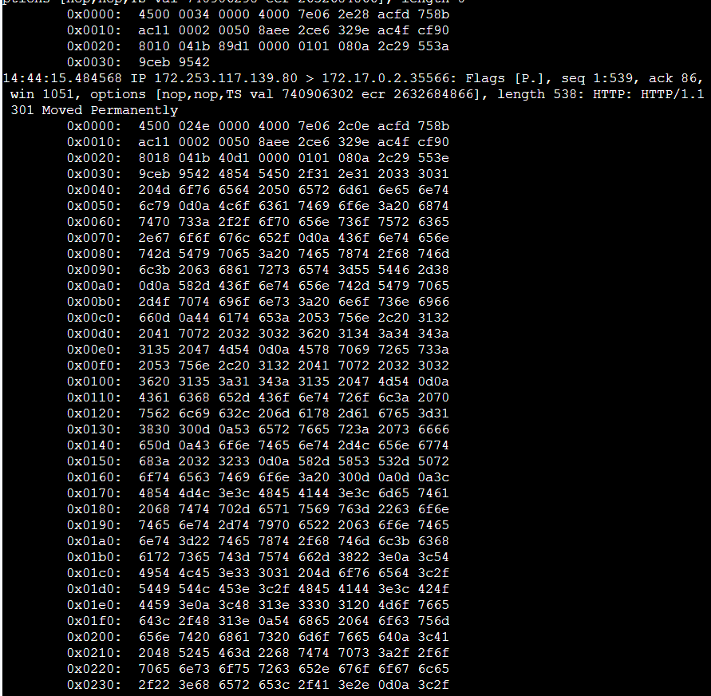

# tcpdump Packet Capture Lab

**Course:** Google Cybersecurity Certificate — Course 6: Sound the Alarm: Detection and Response  
**Lab:** Capture and filter network traffic using tcpdump  
**Date Completed:** April 12, 2026  
**Tool Used:** tcpdump (command-line packet capture and analysis tool)

---

## Scenario

As a network analyst, I was tasked with using tcpdump to capture and analyze live network traffic from a Linux virtual machine. The objective was to:

- Identify available network interfaces for packet capture
- Capture live network traffic using tcpdump filters
- Save packet captures to a .pcap file for later analysis
- Filter and examine captured packet data in detail

---

## Skills Practiced

- Identifying available network interfaces using `ifconfig` and `tcpdump -D`
- Capturing live network traffic with tcpdump using various filters and options
- Understanding tcpdump command-line options (`-i`, `-v`, `-c`, `-nn`, `-w`, `-r`, `-X`)
- Filtering traffic by port number (HTTP port 80)
- Reading and interpreting packet headers (IP, TCP, UDP, DNS)
- Analyzing captured packets in verbose and hexadecimal format
- Saving and loading packet capture files (.pcap format)

---

## Task 1 — Identify Network Interfaces

**Objective:** Identify available network interfaces that can be used for packet capture.

### Identify interfaces using ifconfig

Used `ifconfig` to display all available network interfaces:

```bash
sudo ifconfig
```

**Output shows:**

| Interface | Details |
|---|---|
| **eth0** | UP, BROADCAST, RUNNING, MULTICAST — Ethernet interface |
| **lo** | UP, LOOPBACK, RUNNING — Local loopback interface |

Key information extracted:
- **eth0** (Ethernet): IP 172.17.0.2, MAC 02:42:ac:11:00:02, MTU 1460 bytes
- **lo** (Loopback): IP 127.0.0.1, used for internal system communication

### Identify interfaces using tcpdump

Used `tcpdump -D` to list available capture interfaces:

```bash
sudo tcpdump -D
```

**Output shows 8 available interfaces:**

| Number | Interface | Description |
|---|---|---|
| 1 | eth0 | Up, Connected |
| 2 | any | Pseudo-device that captures on all interfaces |
| 3 | lo | Loopback interface |
| 4 | bluetooth-monitor | Bluetooth Linux Monitor (Wireless) |
| 5 | nflog | Linux netfilter log interface |
| 6 | nfqueue | Linux netfilter queue interface |
| 7 | dbus-system | D-Bus system bus |
| 8 | dbus-session | D-Bus session bus |

**Selected for packet capture:** `eth0` (the active Ethernet interface)

### Screenshot — Task 1: Network Interfaces



---

## Task 2 — Inspect Live Network Traffic with tcpdump

**Objective:** Capture and inspect live network traffic with verbose output.

### Capture live traffic with filters

Used tcpdump to capture 5 packets from eth0 with verbose output:

```bash
sudo tcpdump -i eth0 -v -c5
```

**Command options:**
- `-i eth0`: Capture from the eth0 interface
- `-v`: Display detailed packet information
- `-c5`: Capture 5 packets and exit

### Understanding tcpdump Output

The output includes:

| Element | Example | Description |
|---|---|---|
| **Timestamp** | 14:29:29.377153 | When the packet was captured |
| **Protocol** | IP | The network layer protocol |
| **IP Header Info** | tos 0x0, ttl 64, id 54058 | Type of Service, Time to Live, ID number |
| **Flags** | [DF] | Don't Fragment flag |
| **Protocol Type** | proto TCP (6) | Layer 4 protocol (TCP=6, UDP=17) |
| **Packet Length** | length 128 | Total IP packet size in bytes |

### Packet Details Example

```
14:29:29.377153 IP (tos 0x0, ttl 64, id 54058, offset 0, flags [DF], proto TCP (6), length 128)
    db188b2a9ebc.5000 > nginx-us-west1-b.c.qwiklabs-terminal-vms-prod-00.internal.60756: 
    Flags [P.], cksum 0x595d, seq 3782327424:3782327500, ack 30350598, win 499, length 76
```

**Breaking this down:**
- **Source:** db188b2a9ebc.5000 (local machine, port 5000)
- **Destination:** nginx server, port 60756
- **Flags:** [P.] = Push flag + Acknowledgement flag
- **Sequence:** 3782327424 to 3782327500 (76 bytes of data)
- **Window size:** 499 bytes (TCP flow control)

### Screenshot — Task 2: Live Traffic Capture



---

## Task 3 — Capture Network Traffic to a File

**Objective:** Capture HTTP traffic (port 80) and save to a .pcap file.

### Capture HTTP traffic

Used tcpdump to capture 9 packets on port 80 and save to a file:

```bash
sudo tcpdump -i eth0 -nn -c9 port 80 -w capture.pcap &
```

**Command options:**
- `-i eth0`: Capture from eth0 interface
- `-nn`: No name resolution (don't convert IPs to hostnames or ports to service names)
- `-c9`: Capture 9 packets and exit
- `port 80`: Filter only HTTP traffic (port 80)
- `-w capture.pcap`: Write captured data to file named capture.pcap
- `&`: Run in background

### Generate HTTP traffic

Used curl to generate HTTP traffic to be captured:

```bash
curl opensource.google.com
```

This command initiates an HTTP GET request, which creates port 80 traffic that tcpdump captures.

### Verify capture file

Listed the captured file:

```bash
ls -l capture.pcap
```

**Result:** 9 packets captured and saved to capture.pcap

### HTTP Response Captured

The captured data includes the full HTTP response:

```
GET / HTTP/1.1
Host: opensource.google.com
User-Agent: curl/7.74.0
Accept: */*

HTTP/1.1 301 Moved Permanently
Location: https://opensource.google/
Content-Type: text/html; charset=UTF-8
Server: sffe
```

The server redirects HTTP (port 80) to HTTPS (port 443).

### Screenshot — Task 3: Capture to File



---

## Task 4 — Filter and Analyze Captured Packet Data

**Objective:** Read and filter the captured .pcap file to examine packet details.

### Filter with verbose output

Read the capture file with verbose packet details:

```bash
sudo tcpdump -nn -r capture.pcap -v
```

**Command options:**
- `-nn`: No name resolution (security best practice)
- `-r capture.pcap`: Read from the capture file
- `-v`: Verbose output with detailed packet information

**Sample output:**

```
reading from file capture.pcap, link-type EN10MB (Ethernet)
14:44:15.480009 IP (tos 0x0, ttl 64, id 0, flags [DF], proto TCP (6), length 60)
    172.17.0.2.46498 > 172.253.117.139.80: Flags [S], seq 753283741, ack 280901154, win 65320, length 0
```

This shows:
- **TCP SYN packet** (connection initiation)
- **Source:** 172.17.0.2, port 46498 (client)
- **Destination:** 172.253.117.139, port 80 (server)
- **Flags [S]:** SYN flag (first step of TCP three-way handshake)

### Filter with hexadecimal output

Read the capture file in hexadecimal and ASCII format:

```bash
sudo tcpdump -nn -r capture.pcap -X
```

**Command options:**
- `-X`: Display hexadecimal and ASCII output of packet data

**Sample output:**

```
0x0000: 4500 003c bb03 4000 4006 2e20 acfd 7b8b 0x0010: acfd 8aff b632 0050 8c6f 4d4c 0000 0000
0x0020: a002 ff20 9456 0000 0202 0000
```

**Understanding hexadecimal output:**
- **4500 003c:** IP version, header length, total length
- **0050:** Port 80 in hexadecimal
- **8c6f 4d4c:** Sequence number
- **a002:** Flags (0xa0 = [S.], 0x02 = SYN flag)

### Screenshot — Task 4: Verbose Output



### Screenshot — Task 4: Hexadecimal Output



---

## Key tcpdump Filters and Options

| Filter/Option | Purpose | Example |
|---|---|---|
| `-i interface` | Specify interface to capture from | `tcpdump -i eth0` |
| `-c number` | Capture N packets and exit | `tcpdump -c5` |
| `-v` | Verbose output with detailed info | `tcpdump -v` |
| `-nn` | No name resolution (security best practice) | `tcpdump -nn` |
| `-w file.pcap` | Write capture to file | `tcpdump -w capture.pcap` |
| `-r file.pcap` | Read from capture file | `tcpdump -r capture.pcap` |
| `-X` | Hexadecimal and ASCII output | `tcpdump -X` |
| `port 80` | Filter by port number | `tcpdump port 80` |
| `tcp` | Filter by protocol | `tcpdump tcp` |
| `udp` | Filter UDP traffic | `tcpdump udp` |
| `host X.X.X.X` | Filter by IP address | `tcpdump host 192.168.1.1` |

---

## Key Takeaways

1. **Network interfaces must be identified** before capturing — use `ifconfig` or `tcpdump -D`
2. **tcpdump is powerful and flexible** — filter by protocol, port, IP, and more
3. **No name resolution is a security best practice** — use `-nn` to avoid DNS lookups that could alert threat actors
4. **.pcap files are portable** — capture once, analyze multiple times with different filters
5. **Verbose and hexadecimal output reveal packet structure** — IP headers, TCP flags, checksums, and payload data
6. **TCP flags tell the connection story:**
   - `[S]` = SYN (connection initiation)
   - `[.]` = ACK (acknowledgement)
   - `[P]` = PUSH (push data)
   - `[F]` = FIN (connection termination)
   - `[R]` = RST (reset)

---

## Lab Score

| Task | Completed |
|---|---|
| Task 1 — Identify network interfaces | ✅ |
| Task 2 — Inspect live network traffic | ✅ |
| Task 3 — Capture network traffic to file | ✅ |
| Task 4 — Filter captured packet data | ✅ |

**Lab Status:** Complete — All tasks and analysis finished successfully.
