# Wireshark Packet Analysis Lab

**Course:** Google Cybersecurity Certificate — Course 6: Sound the Alarm: Detection and Response  
**Lab:** Analyze your first packet with Wireshark  
**Date Completed:** April 9, 2026  
**Tool Used:** Wireshark (GUI-based network protocol analyzer)

---

## Scenario

As a security analyst, I was tasked with investigating traffic to a website. I analyzed a network packet capture file (`sample.pcap`) containing traffic data related to a user connecting to an internet site. The goal was to filter network traffic to:

- Identify source and destination IP addresses in a web browsing session
- Examine protocols used when connecting to a website
- Analyze data packets to identify the type of information sent and received

---

## Skills Practiced

- Opening and navigating `.pcap` files in Wireshark
- Applying display filters to isolate specific traffic
- Inspecting packet layers (Ethernet II, IPv4, TCP, DNS)
- Reading packet headers (TTL, Frame Length, Port numbers, MAC addresses)
- Filtering DNS and TCP traffic for investigation

---

## Task 1 — Explore Data with Wireshark

**Objective:** Open the packet capture file and explore the Wireshark interface.

Opened `sample.pcap` in Wireshark. The capture contained 200 total packets. Key columns visible in the packet list:

| Column | Description |
|---|---|
| No. | Index number of packet |
| Time | Timestamp of packet |
| Source | Source IP address |
| Destination | Destination IP address |
| Protocol | Protocol in the packet |
| Length | Total packet length |
| Info | Payload description |

Wireshark uses color coding to quickly classify traffic:
- **Light blue** = DNS traffic
- **Light green** = TCP / HTTP traffic
- **Light pink** = ICMP traffic

### Screenshot — Task 1: Wireshark Overview

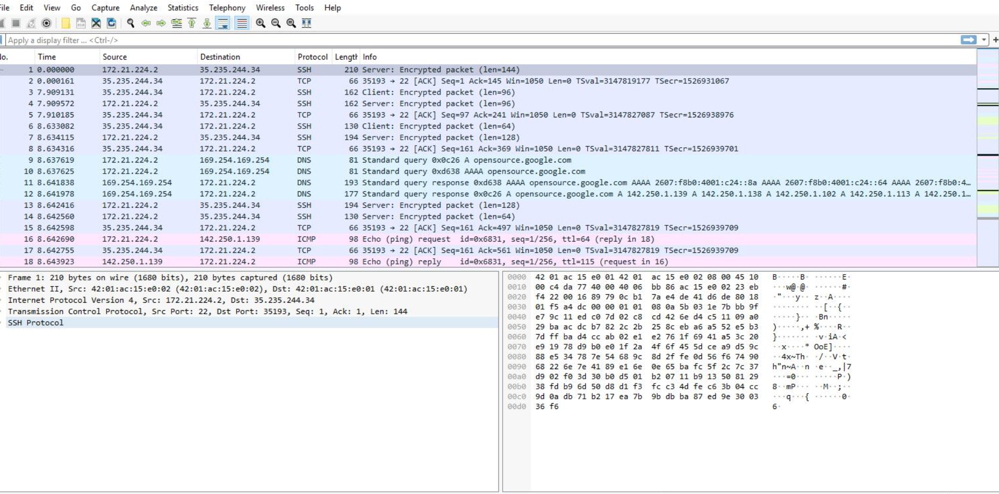

**Question:** What is the protocol of the first packet where the Info column starts with "Echo (ping) request"?

**Answer:** ✅ **ICMP**

**Why:** ICMP (Internet Control Message Protocol) is the protocol used for ping requests. A ping sends an Echo Request and expects an Echo Reply — used to test connectivity between two hosts.

---

## Task 2 — Apply a Basic Wireshark Filter and Inspect a Packet

**Objective:** Filter traffic by IP address and inspect individual packet layers.

**Filter applied:**
```
ip.addr == 142.250.1.139
```

This returned only packets where either the source or destination IP matched `142.250.1.139`. The display reduced from 200 packets to 16 (8.0%).

### Screenshot — Task 2: IP Filter Applied

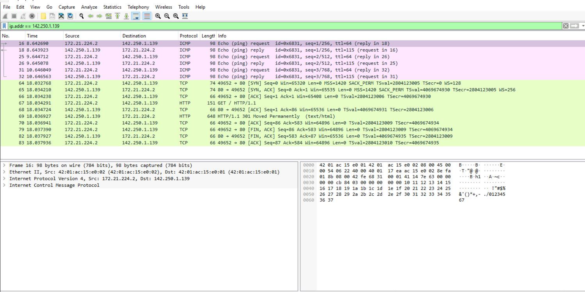

### Screenshot — Task 2: Packet Details Pane

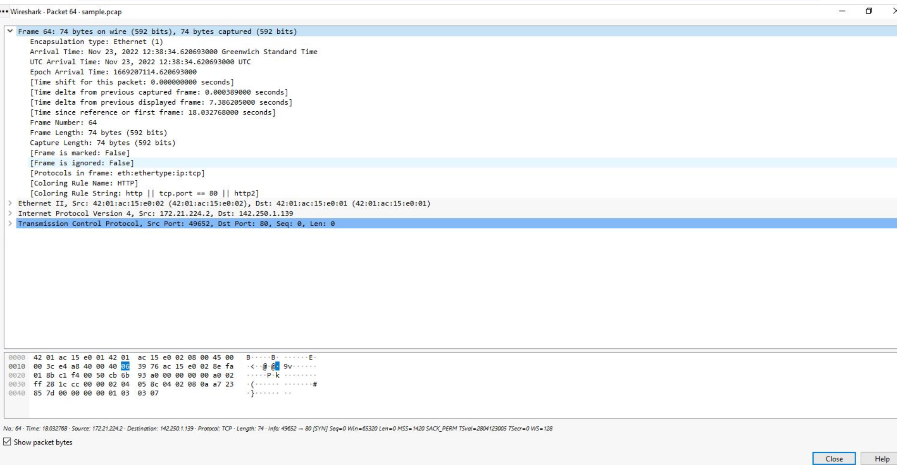

### Screenshot — Task 2: IPv4 Layer Expanded

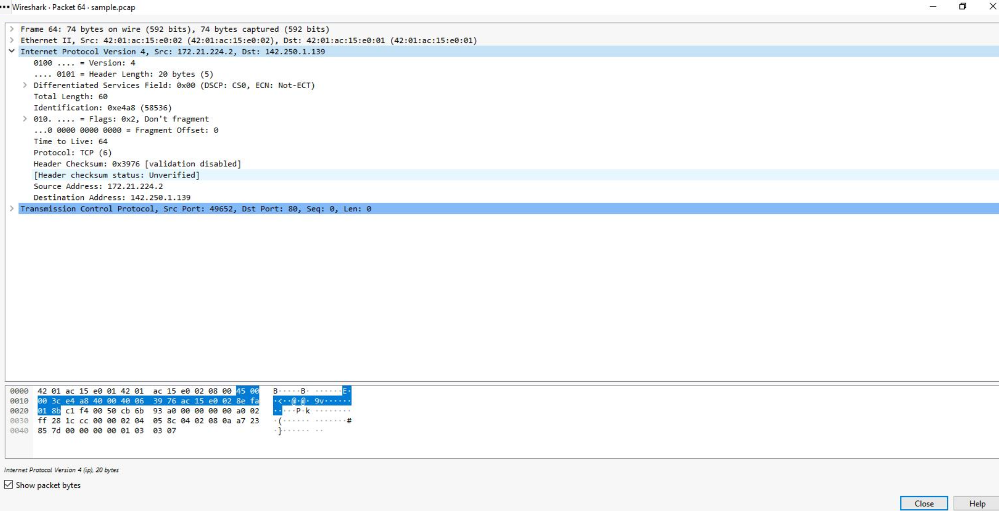

### Screenshot — Task 2: TCP Layer Expanded

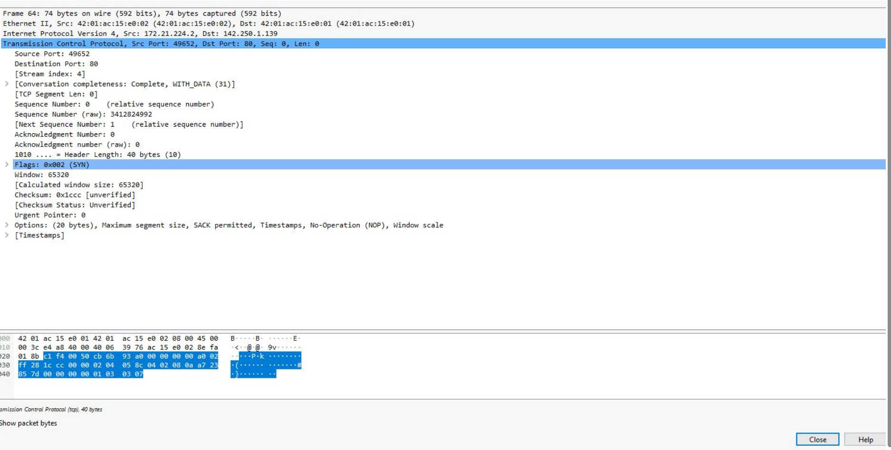

### Layer Breakdown — Packet 64

| Layer | Details |
|---|---|
| **Frame** | 74 bytes on wire, arrived Nov 23, 2022 at 12:38:34 UTC |
| **Ethernet II** | Src MAC: `42:01:ac:15:e0:02` → Dst MAC: `42:01:ac:15:e0:01`, Type: IPv4 |
| **IPv4** | Src: `172.21.224.2` → Dst: `142.250.1.139`, Protocol: TCP |
| **TCP** | Src Port: `49652` → Dst Port: `80`, Flags: SYN (0x002) |

This packet represents the **TCP SYN** — the first step of the TCP three-way handshake initiating a connection to port 80 (HTTP).

**Question:** What is the TCP destination port of this TCP packet?

**Answer:** ✅ **80**

**Why:** Port 80 is the default port for HTTP (unencrypted web traffic). The SYN flag confirms this is the initial connection request.

---

## Task 3 — Use Filters to Select Packets

**Objective:** Filter traffic by source IP, destination IP, and MAC address.

### Filter by Source IP
```
ip.src == 142.250.1.139
```

### Screenshot — Task 3: Source IP Filter

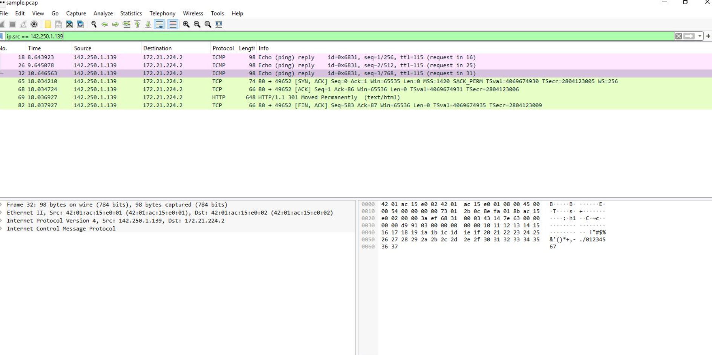

### Filter by Destination IP
```
ip.dst == 142.250.1.139
```

### Screenshot — Task 3: Destination IP Filter

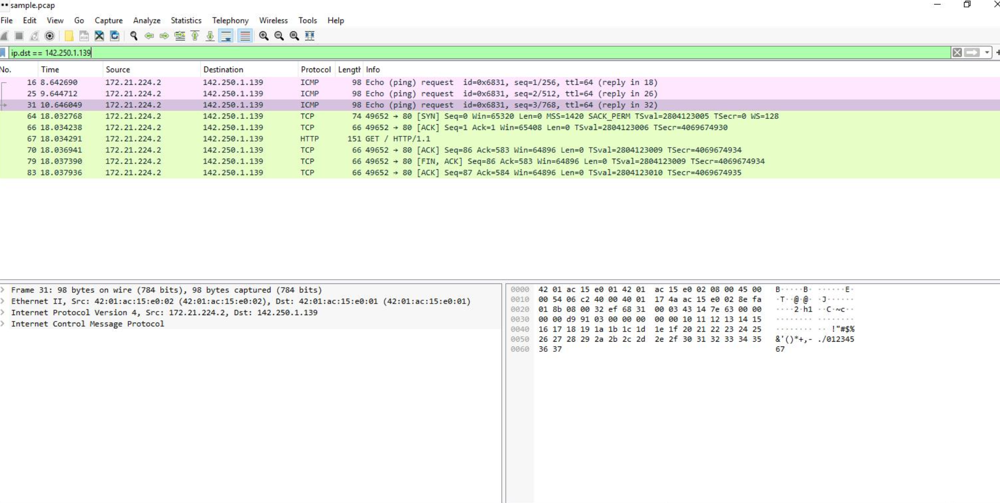

### Filter by MAC Address
```
eth.addr == 42:01:ac:15:e0:02
```

### Screenshot — Task 3: MAC Address Filter

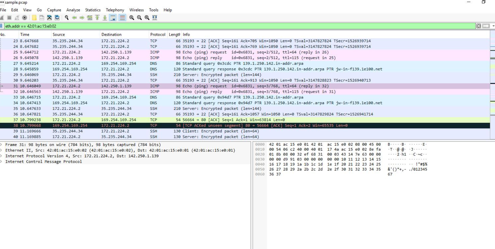

### Screenshot — Task 3: Packet 1 Layer Details

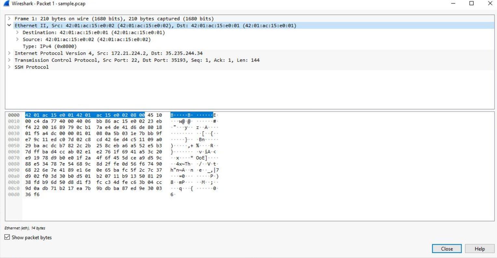

**Packet 1 Details:**
- Protocol: **SSH** (Source Port 22 → Destination Port 35193)
- Frame Length: 210 bytes
- Src IP: `172.21.224.2` → Dst IP: `35.235.244.34`

**Question:** What is the protocol in the IPv4 subtree for the first packet related to MAC address `42:01:ac:15:e0:02`?

**Answer:** ✅ **TCP**

**Why:** SSH runs over TCP. The IPv4 layer shows Protocol: TCP (6), which encapsulates the SSH application layer traffic.

---

## Task 4 — Use Filters to Explore DNS Packets

**Objective:** Filter and examine DNS traffic to understand how domain name resolution works.

**Filter applied:**
```
udp.port == 53
```

### Screenshot — Task 4: DNS Query

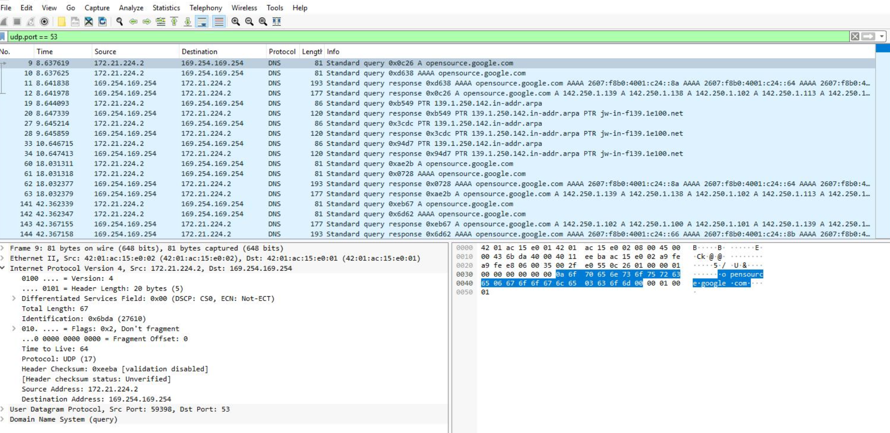

### Screenshot — Task 4: DNS Response with Answers

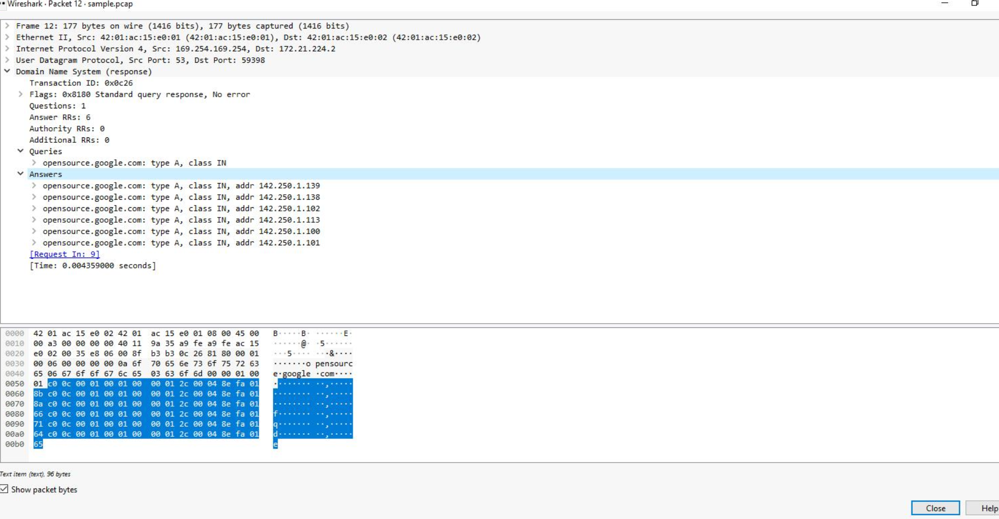

### DNS Response — Packet 12

| Answer | IP Address |
|---|---|
| opensource.google.com | `142.250.1.139` |
| opensource.google.com | `142.250.1.138` |
| opensource.google.com | `142.250.1.102` |
| opensource.google.com | `142.250.1.113` |
| opensource.google.com | `142.250.1.100` |

**Question:** Which IP address is displayed in the Answers section for the DNS query for `opensource.google.com`?

**Answer:** ✅ **142.250.1.139**

**Why:** The DNS server returned multiple IP addresses for `opensource.google.com`. Large services like Google use multiple IPs for load balancing. The client connects to one of them.

---

## Task 5 — Use Filters to Explore TCP Packets

**Objective:** Filter TCP port 80 traffic and search for specific payload text.

### Filter by TCP Port
```
tcp.port == 80
```

### Screenshot — Task 5: TCP Port 80 Filter


### Screenshot — Task 5: Packet 37 Details

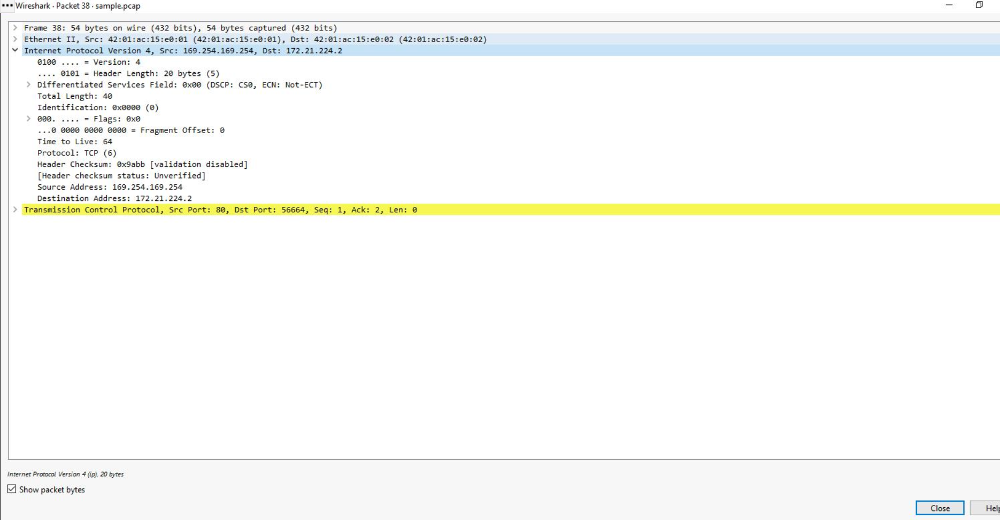

### Screenshot — Task 5: IPv4 Header Details

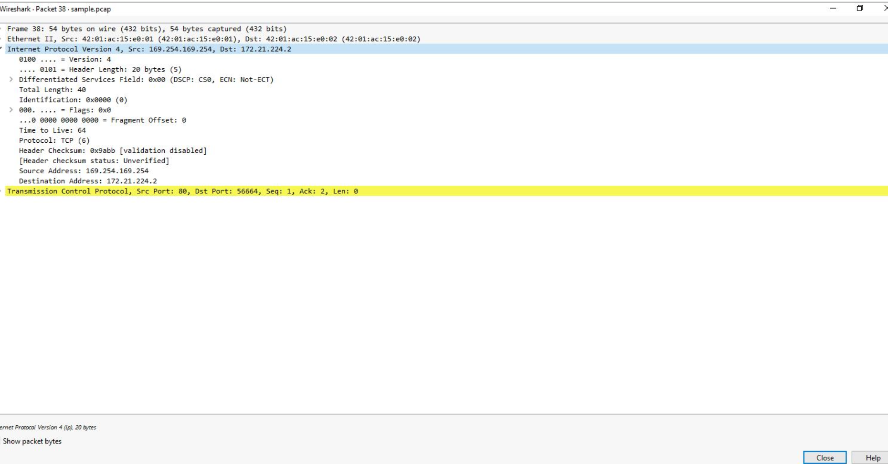

### Packet 37 — Full Header Analysis

| Field | Value |
|---|---|
| **Frame Length** | 54 bytes |
| **IPv4 Header Length** | 20 bytes |
| **Time to Live (TTL)** | 64 |
| **Destination Address** | `169.254.169.254` |
| **Source Address** | `172.21.224.2` |
| **Protocol** | TCP (6) |

### Filter by Payload Content
```
tcp contains "curl"
```

### Screenshot — Task 5: Payload Text Search

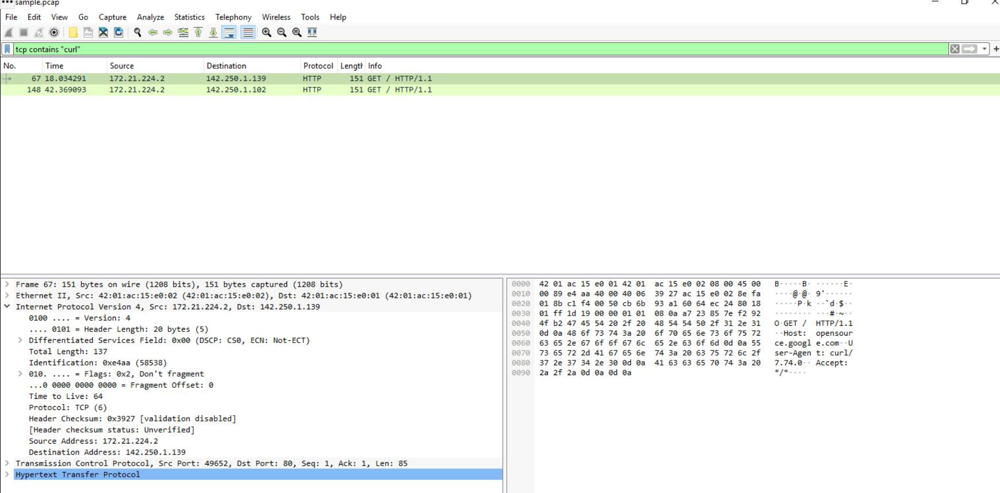

This returned 2 packets — HTTP GET requests made using the `curl` command-line tool:
- **Packet 67:** `GET / HTTP/1.1` → `142.250.1.139`
- **Packet 148:** `GET / HTTP/1.1` → `142.250.1.102`

**Questions and Answers:**

| Question | Answer |
|---|---|
| Time to Live? | ✅ **64** |
| Frame Length? | ✅ **54 bytes** |
| Header Length? | ✅ **20 bytes** |
| Destination Address? | ✅ **169.254.169.254** |

---

## Key Filters Used in This Lab

| Filter | Purpose |
|---|---|
| `ip.addr == X.X.X.X` | All traffic to or from an IP |
| `ip.src == X.X.X.X` | Only traffic sent FROM an IP |
| `ip.dst == X.X.X.X` | Only traffic sent TO an IP |
| `eth.addr == XX:XX:XX:XX:XX:XX` | All traffic for a MAC address |
| `udp.port == 53` | DNS traffic only |
| `tcp.port == 80` | HTTP traffic only |
| `tcp contains "text"` | Packets with specific payload text |

---

## Key Takeaways

1. **Wireshark displays packets in layers** — each layer adds its own header with important metadata
2. **Display filters are essential** — real captures can have millions of packets without filters
3. **DNS reveals intent** — DNS queries show which domains a host is trying to reach before a connection is established
4. **TCP flags tell the story** — SYN, SYN/ACK, ACK, FIN/ACK reveal the full connection lifecycle
5. **Payload filters find hidden data** — `tcp contains` surfaces specific text in unencrypted traffic, critical for detecting data exfiltration
6. **TTL values indicate OS** — TTL 64 = Linux/Mac, TTL 128 = Windows

---

## Lab Score

| Task | Completed |
|---|---|
| Task 1 — Explore data with Wireshark | ✅ |
| Task 2 — Apply a basic filter and inspect a packet | ✅ |
| Task 3 — Use filters to select packets | ✅ |
| Task 4 — Use filters to explore DNS packets | ✅ |
| Task 5 — Use filters to explore TCP packets | ✅ |

**All questions answered correctly.**
